# 🎓 UEMS - University Exam Management System

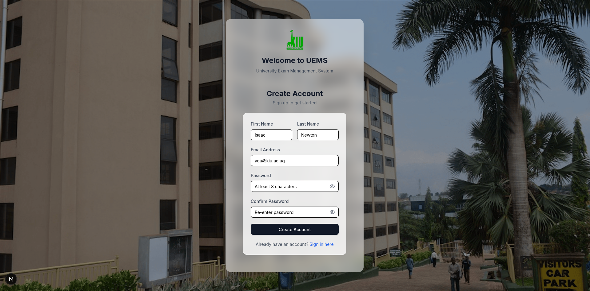

A comprehensive digital solution for managing university examination papers, from question creation to final publication and printing.

[](https://nextjs.org/)
[](https://www.typescriptlang.org/)
[](https://www.mysql.com/)
[](https://tailwindcss.com/)

---

## 📋 Table of Contents

- [Overview](#overview)
- [Key Features](#key-features)
- [Tech Stack](#tech-stack)
- [System Workflow](#system-workflow)
- [Screenshots](#screenshots)
- [Getting Started](#getting-started)
- [Project Structure](#project-structure)
- [Database Schema](#database-schema)
- [User Roles](#user-roles)
- [API Routes](#api-routes)
- [Contributing](#contributing)
- [License](#license)

---

## 🌟 Overview

UEMS (University Exam Management System) streamlines the entire examination lifecycle at Kampala International University. The system manages everything from question bank creation to exam paper approval, printing, and publication, ensuring academic integrity and efficient workflows.

### Problem Statement

Traditional exam management involves:
- ❌ Manual paper handling and version control
- ❌ Disconnected approval workflows
- ❌ Lack of audit trails
- ❌ Inefficient question reuse
- ❌ Poor visibility into paper status

### Our Solution

UEMS provides:
- ✅ Digital question bank with categorization
- ✅ Automated approval workflows (Lecturer → HOD → Exam Master)
- ✅ Real-time notifications and status tracking
- ✅ Comprehensive audit logging
- ✅ Role-based access control (RBAC)
- ✅ Support for hierarchical questions with unlimited sub-questions

---

## ✨ Key Features

### 📚 Question Bank Management
- Create and categorize questions by course, study unit, difficulty
- Support for multiple question types (MCQ, Essay, Practical, etc.)
- Bloom's taxonomy classification
- Question reusability tracking
- HOD approval workflow for questions

### 📝 Exam Paper Creation
- Visual paper builder with drag-and-drop
- **Hierarchical question support** with unlimited nesting levels
- Section management (Section A, B, C, etc.)
- Automatic mark calculation
- Choice questions (e.g., "Answer any 2 of 3")
- Custom instructions and footer text
- Real-time preview

### ✅ Approval Workflow
```
Draft → Submit → HOD Review → HOD Approval → Ready for Print → Printing → Printed → Published
```
- Multi-stage approval process
- Feedback and comments at each stage
- Version history tracking
- Email/in-app notifications

### 🖨️ Print Management
- Centralized print queue for Exam Master
- Track printing status and quantities
- Print history and audit trail
- Bulk printing support

### 👥 User Management
- Role-based permissions (Lecturer, HOD, Dean, Exam Master, Admin)
- Granular course-level permissions
- HOD can grant question creation rights to lecturers
- Secure authentication with session management

### 📊 Reports & Analytics
- Dashboard with key metrics
- Paper statistics by status, course, and programme
- Question usage analytics
- Workflow bottleneck identification
- Audit logs and activity history

---

## 🛠️ Tech Stack

| Component | Technology |
|-----------|-----------|
| **Frontend** | Next.js 14+ (App Router), React, TypeScript |
| **Styling** | Tailwind CSS v4, Shadcn UI |
| **Backend** | Next.js API Routes (TypeScript) |
| **Database** | MySQL 8+ (XAMPP) |
| **ORM** | Raw SQL with `mysql2/promise` |
| **Authentication** | Custom session-based auth |
| **State Management** | React Server Components + Client State |
| **Deployment** | Vercel (recommended) or self-hosted |

---

## 🔄 System Workflow

### Lecturer Journey
1. **Create Paper**: Select course, exam type, and academic details
2. **Add Questions**: Choose from question bank or add new questions
3. **Add Sub-Questions**: Create hierarchical question structures (e.g., 1a, 1b, 1b(i))
4. **Preview**: Review formatted exam paper
5. **Submit**: Send to HOD for approval
6. **Receive Feedback**: View HOD comments and revise if needed

### HOD Journey
1. **Review Submissions**: View pending papers in approval queue
2. **Quality Check**: Review questions, marks, and structure
3. **Provide Feedback**: Add comments or request revisions
4. **Approve/Reject**: Make approval decision
5. **Forward**: Approved papers move to print queue

### Exam Master Journey
1. **View Print Queue**: See all papers ready for printing
2. **Start Printing**: Mark paper as "printing"
3. **Set Quantity**: Specify number of copies
4. **Complete**: Mark paper as "printed"
5. **Publish**: Make paper available for exam day

---

## 📸 Screenshots

### 🔐 Register Page
*User registration interface for new accounts*

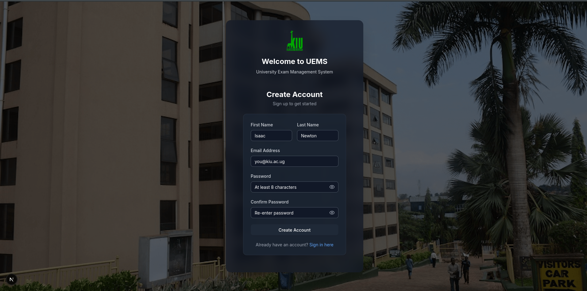

---

### 🔐 Login Page
*Secure authentication interface*

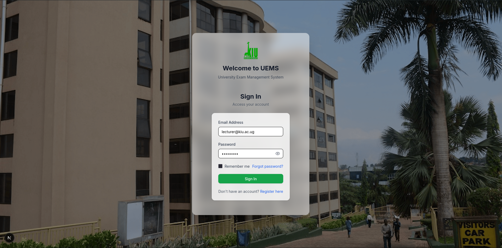

---

### 🏠 Dashboard
*Main dashboard showing system overview and key metrics*

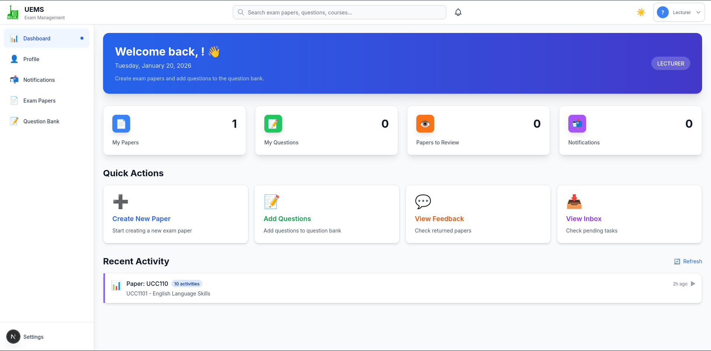

---

### 📋 Question Bank
*Browse and manage questions by course and study unit*

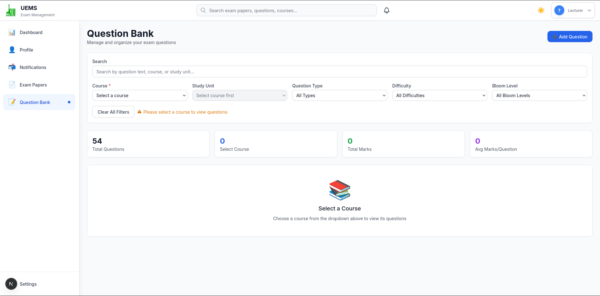

---

### ✍️ Exam Paper Creation
*Create exam papers with visual question builder*

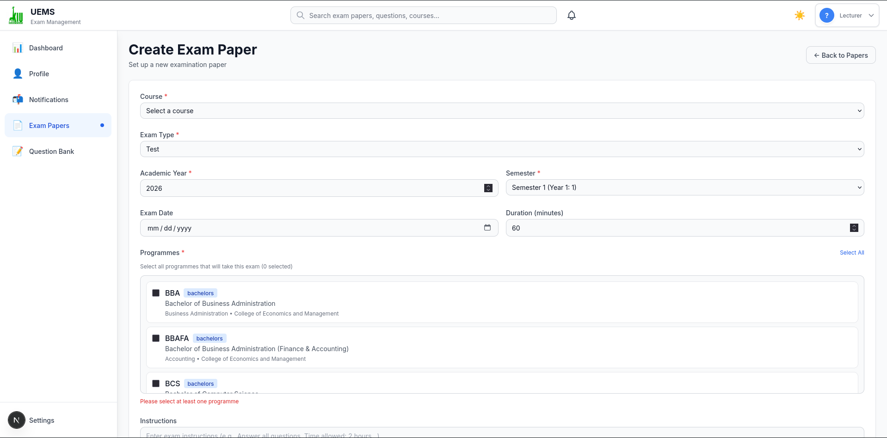

---

### 🌳 Hierarchical Questions
*Add sub-questions with unlimited nesting (a, b, c, i, ii, iii)*

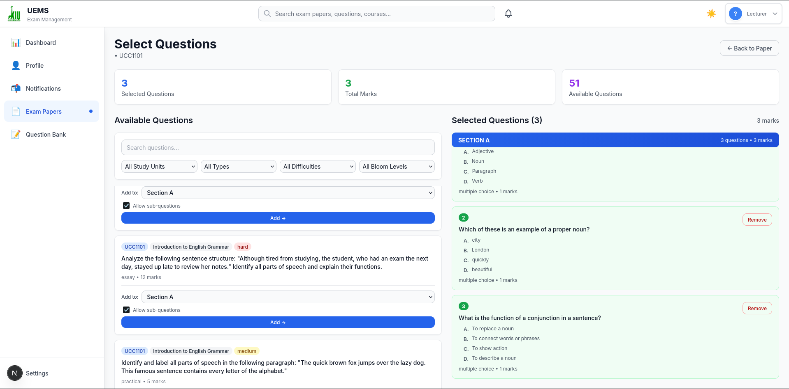

---

### 📄 Paper Preview
*Preview formatted exam paper before submission*

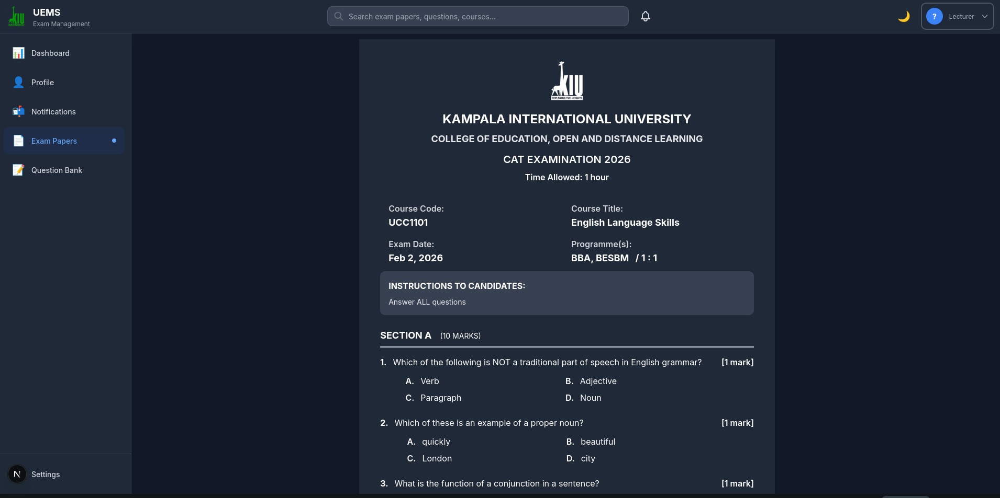

---

### ✅ Approval Workflow
*HOD review and approval interface*

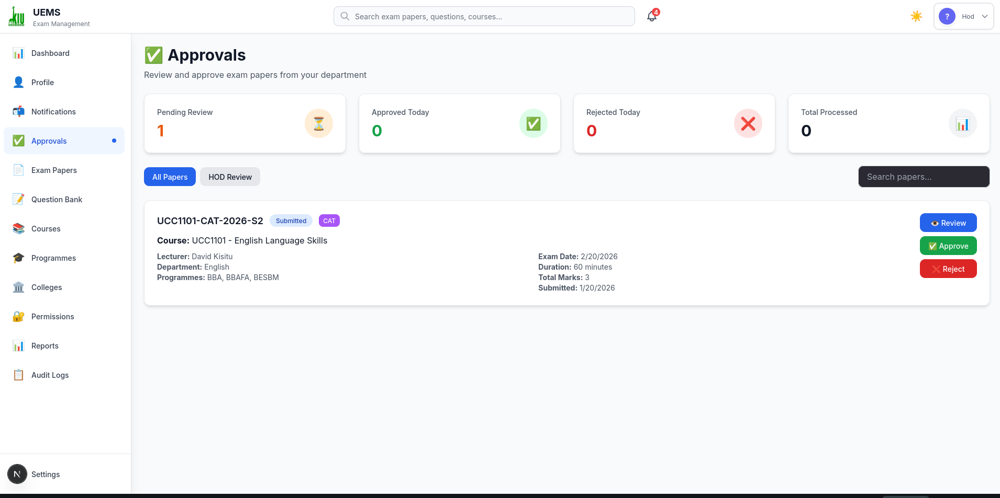

---

### 🖨️ Print Queue
*Exam Master print management dashboard*

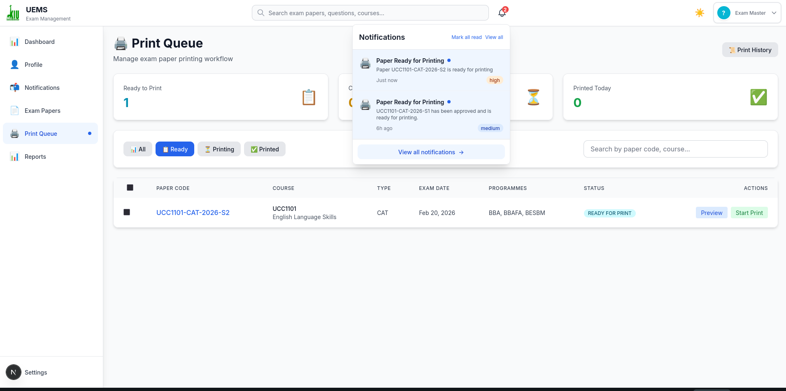

---

### 🔔 Notifications
*Real-time notifications and activity feed*

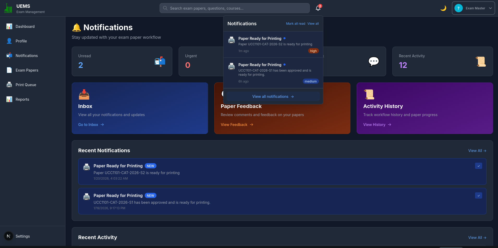

---

### 📊 Reports & Analytics
*Comprehensive reports and statistics*

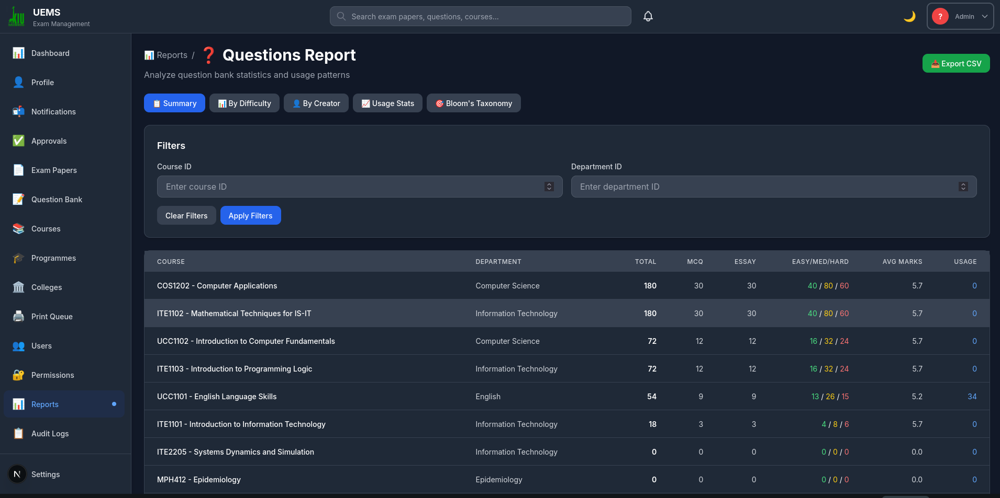

---

### 👥 User Management
*Manage users and permissions*

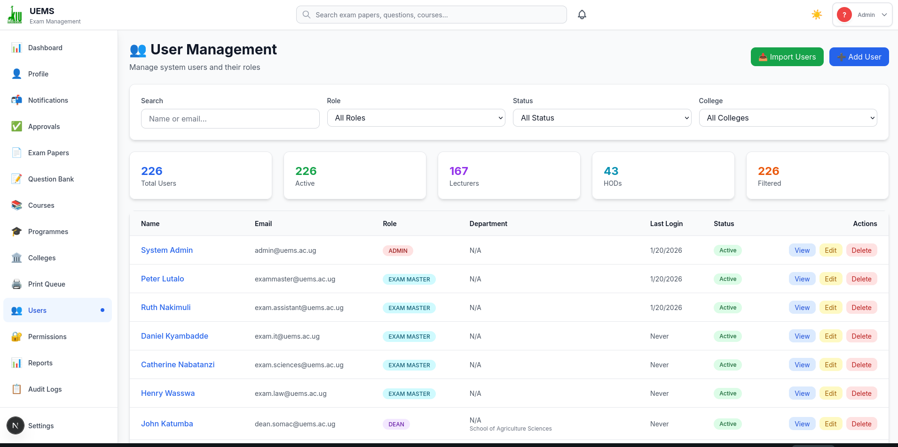

---

### 🏛️ Organizational Structure
*Manage colleges, departments, and programmes*

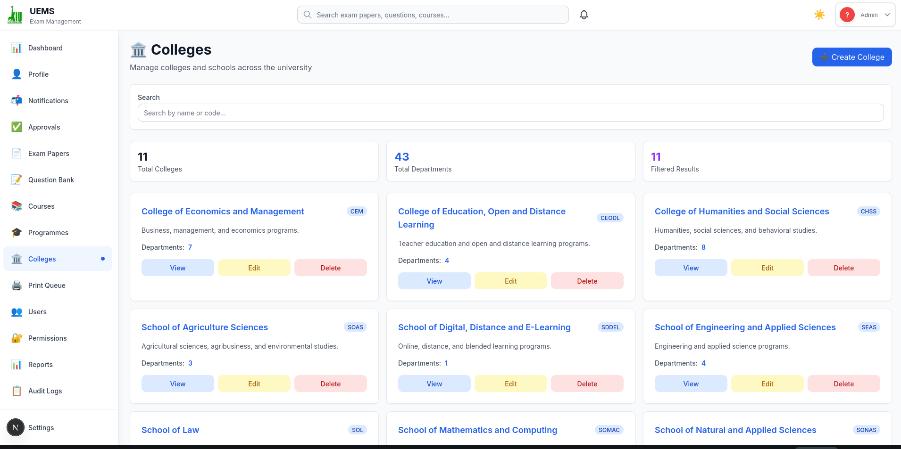

---

## 🚀 Getting Started

### Prerequisites

- Node.js 18+ installed
- MySQL 8+ (via XAMPP or standalone)
- npm or yarn package manager

### Installation

1. **Clone the repository**
   ```bash
   git clone https://github.com/spidertabs/uems.git
   cd uems
   ```

2. **Install dependencies**
   ```bash
   npm install
   # or
   yarn install
   ```

3. **Set up environment variables**
   
   Create a `.env.local` file in the root directory:
   ```env
   # Database Configuration
   DB_HOST=localhost
   DB_PORT=3306
   DB_USER=root
   DB_PASSWORD=your_password
   DB_NAME=uems
   
   # Session Secret
   SESSION_SECRET=your-super-secret-key-here
   
   # App Configuration
   NEXT_PUBLIC_APP_URL=http://localhost:3000
   NODE_ENV=development
   ```

4. **Set up the database**
   
   Start XAMPP and run the SQL scripts:
   ```bash
   # In MySQL (via phpMyAdmin or CLI)
   mysql -u root -p
   
   # Create database
   CREATE DATABASE uems;
   USE uems;
   
   # Run schema
   SOURCE sql/schema.sql;
   
   # Run seed data
   SOURCE sql/seed.sql;
   
   # Load study units (optional)
   SOURCE sql/study_units.sql;
   
   # Load sample questions (optional)
   SOURCE sql/questions.sql;
   ```

5. **Run the development server**
   ```bash
   npm run dev
   # or
   yarn dev
   ```

6. **Open your browser**
   
   Navigate to [http://localhost:3000](http://localhost:3000)

### Default Login Credentials

After running the seed script, use these credentials: use default password: uems@2026

| Role | Email | Password |
|------|-------|----------|
| **Admin** | admin@kiu.ac.ug | admin@123 |
| **HOD** | hod@kiu.ac.ug | Hod@123 |
| **Lecturer** | lecturer@kiu.ac.ug | Lecturer@123 |
| **Exam Master** | exammaster@kiu.ac.ug | ExamMaster@123 |

---

## 📁 Project Structure

```
uems/
├── public/
│   ├── static/images/          # KIU logos and branding
│   └── screenshots/            # 📸 PLACE YOUR SCREENSHOTS HERE
├── sql/
│   ├── schema.sql              # Database schema with triggers
│   ├── seed.sql                # Initial data
│   ├── study_units.sql         # Study unit data
│   └── questions.sql           # Sample questions
├── src/
│   ├── app/
│   │   ├── api/                # API routes
│   │   │   ├── auth/           # Authentication endpoints
│   │   │   ├── exam-papers/    # Paper management
│   │   │   ├── question-bank/  # Question CRUD
│   │   │   ├── approvals/      # Approval workflows
│   │   │   ├── print-queue/    # Print management
│   │   │   └── ...
│   │   ├── (dashboard)/        # Protected dashboard pages
│   │   │   ├── page.tsx        # Dashboard home
│   │   │   ├── exam-papers/    # Paper management UI
│   │   │   ├── question-bank/  # Question bank UI
│   │   │   ├── approvals/      # Approval UI
│   │   │   └── ...
│   │   ├── auth/               # Auth pages (login, register)
│   │   ├── globals.css         # Global styles
│   │   └── layout.tsx          # Root layout
│   ├── components/
│   │   └── ui/                 # Shadcn UI components
│   ├── lib/
│   │   ├── db.ts               # Database connection
│   │   ├── auth.ts             # Auth utilities
│   │   ├── rbac.ts             # Role-based access control
│   │   ├── auditLogger.ts      # Audit logging
│   │   └── utils.ts            # Helper functions
│   └── types/
│       └── index.ts            # TypeScript type definitions
├── .env.local                  # Environment variables (create this)
├── package.json
├── tsconfig.json
└── tailwind.config.js
```

### 📸 Where Screenshots are placed

In `screenshots` folder inside `public/`:

```bash
public/screenshots
```

Add with these names:

```
public/screenshots/
├── register.png                     # User registration page
├── login.png                        # Login page
├── dashboard.png                    # Main dashboard
├── question-bank.png                # Question bank listing
├── paper-creation.png               # Exam paper creation form
├── hierarchical-questions.png       # Sub-questions interface
├── paper-preview.png                # Paper preview/formatting
├── approval-workflow.png            # HOD approval interface
├── print-queue.png                  # Print queue management
├── notifications.png                # Notifications page
├── reports.png                      # Reports and analytics
├── user-management.png              # User management
└── organizational-structure.png     # Colleges/Departments
```

**Of a Recommended Screenshot Dimensions**: 1920x1080 or 1440x900 (16:9 ratio)

---

## 🗄️ Database Schema

### Core Tables

| Table | Purpose |
|-------|---------|
| `users` | User accounts with role-based access |
| `colleges` | Academic colleges/schools (SOMAC, SONAS, etc.) |
| `departments` | Departments under colleges |
| `programmes` | Academic programmes (BIT, DIT, BSTAT, etc.) |
| `courses` | Individual courses |
| `study_units` | Course modules/units |
| `questions` | Question bank |
| `exam_papers` | Exam paper metadata |
| `exam_paper_questions` | Questions in papers (with sub-questions) |
| `exam_paper_programmes` | Paper-programme associations |

### Supporting Tables

| Table | Purpose |
|-------|---------|
| `lecturer_permissions` | HOD-granted permissions to lecturers |
| `workflow_history` | Complete audit trail of paper lifecycle |
| `paper_comments` | Feedback and comments on papers |
| `notifications` | User notifications |
| `audit_logs` | System-wide activity logs |
| `sessions` | User authentication sessions |

### Key Features

- **Hierarchical Questions**: Unlimited nesting with `parent_question_id`
- **Soft Deletes**: All tables support `deleted_at` for data recovery
- **JSON Support**: Flexible metadata storage
- **Triggers**: Auto-calculate total marks, validate constraints
- **Views**: Pre-built queries for common operations

---

## 👥 User Roles

### 🎓 Lecturer
- Create exam papers
- Add questions (with HOD permission)
- Submit papers for approval
- View feedback and revisions
- Track paper status

### 👔 HOD (Head of Department)
- Create courses and study units
- Create and approve questions
- Grant permissions to lecturers
- Review and approve ALL exam papers
- Provide feedback
- Manage department resources

### 🏛️ Dean
- Oversee college-level operations
- Review papers across departments
- Provide high-level feedback
- Optional approval layer for final exams

### 🖨️ Exam Master
- View all approved papers
- Manage print queue
- Track printing status
- Set print quantities
- Mark papers as printed/published

### ⚙️ Admin
- Full system access
- User management
- System configuration
- View audit logs
- Manage soft-deleted records

---

## 🔌 API Routes

### Authentication
```
POST   /api/auth/login
POST   /api/auth/logout
POST   /api/auth/register
GET    /api/auth/me
POST   /api/auth/change-password
```

### Exam Papers
```
GET    /api/exam-papers
POST   /api/exam-papers/create
GET    /api/exam-papers/[paperId]
PUT    /api/exam-papers/[paperId]
DELETE /api/exam-papers/[paperId]
POST   /api/exam-papers/[paperId]/submit
POST   /api/exam-papers/[paperId]/approve
GET    /api/exam-papers/[paperId]/questions
POST   /api/exam-papers/[paperId]/questions
DELETE /api/exam-papers/[paperId]/questions/[questionId]
```

### Question Bank
```
GET    /api/question-bank
POST   /api/question-bank/create
GET    /api/question-bank/[id]
PUT    /api/question-bank/[id]
DELETE /api/question-bank/[id]
```

### Approvals
```
GET    /api/approvals/pending
POST   /api/approvals/[paperId]/approve
POST   /api/approvals/[paperId]/reject
```

### Print Queue
```
GET    /api/print-queue
GET    /api/print-queue/[paperId]
POST   /api/print-queue/[paperId]/start
POST   /api/print-queue/[paperId]/complete
```

### Notifications
```
GET    /api/notifications
POST   /api/notifications/[id]/read
POST   /api/notifications/mark-all-read
```

---

## 🎯 Development Roadmap

### ✅ Phase 1 (Completed)
- [x] Database schema design
- [x] Authentication system
- [x] Question bank CRUD
- [x] Exam paper creation
- [x] Hierarchical sub-questions
- [x] Approval workflow
- [x] Print queue management

### 🔄 Phase 2 (In Progress)
- [ ] Bulk operations
- [ ] Advanced reporting
- [ ] Search and filters
- [ ] Email notifications
- [ ] Document generation (PDF export)

### 📅 Phase 3 (Planned)
- [ ] Analytics dashboard
- [ ] Plagiarism detection
- [ ] Mobile app (React Native)
- [ ] AI-powered question suggestions

---

## 🤝 Contributing

We welcome contributions! Please follow these steps:

1. Fork the repository
2. Create a feature branch (`git checkout -b feature/AmazingFeature`)
3. Commit your changes (`git commit -m 'Add some AmazingFeature'`)
4. Push to the branch (`git push origin feature/AmazingFeature`)
5. Open a Pull Request

### Coding Standards

- Use TypeScript for all new code
- Follow the existing code structure
- Add JSDoc comments for functions
- Write meaningful commit messages
- Test your changes before submitting

---

## 📄 Licence

This project is licensed under the MIT Licence - see the [LICENCE](LICENCE) file for details.

**Copyright © 2026 Spider Tabs Ltd**

---

## 👨‍💻 Authors

- **Gava Hans** - Lead Developer
- **Ocen Isaac** - Developer
- **Sempuwo Mathew David** - Developer

---

## 🙏 Acknowledgments

- **Kampala International University** for the opportunity
- **Shadcn UI** for the beautiful component library
- **Next.js Team** for the amazing framework
- All contributors and testers

---

## 📧 Contact

For questions, issues, or suggestions:

- **Project Team**: Gava Hans, Ocen Isaac, Sempuwo Mathew David
- **Email**: spider.tabs@gmail.com

---

<div align="center">
  <p>Built with ❤️ by <strong>Spider Tabs Ltd</strong> At Kampala International University</p>
  <p>
    
  </p>
  <p><em>Gava Hans • Ocen Isaac • Sempuwo Mathew David</em></p>
</div>