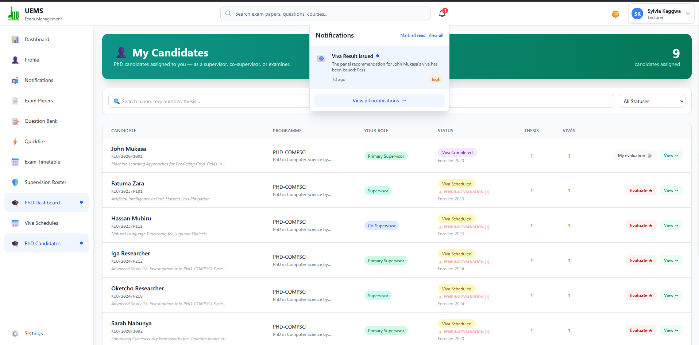
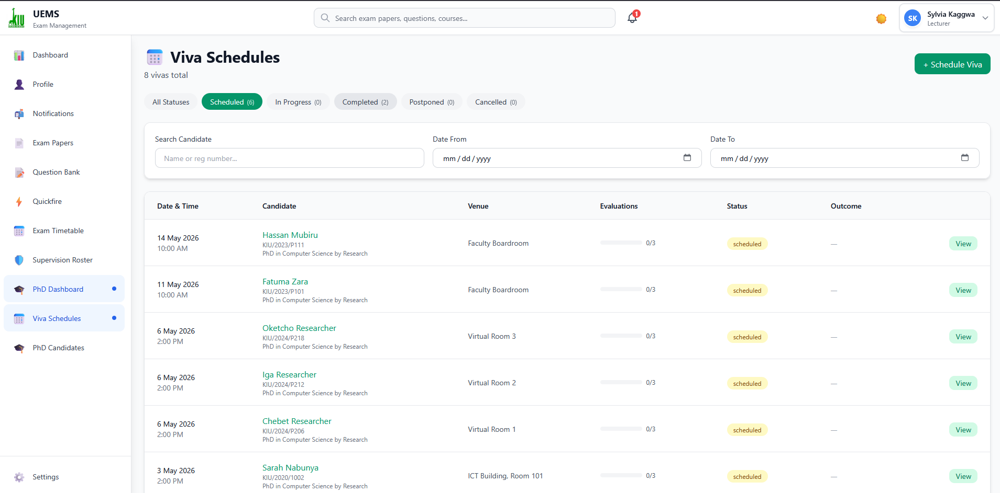

# 🎓 UEMS-PHD-VV — University Examination Management System & PhD Viva Voce Administration


A unified digital platform for managing the complete academic examination lifecycle at Kampala International University — from course exam paper creation through to PhD thesis defence administration.

[](https://nextjs.org/)
[](https://www.typescriptlang.org/)
[](https://www.mysql.com/)
[](https://tailwindcss.com/)
[](https://github.com/spidertabs/uems)

---

## 📋 Table of Contents

- [Overview](#overview)
- [Key Features](#key-features)
- [Tech Stack](#tech-stack)
- [System Workflow](#system-workflow)
- [Screenshots](#screenshots)
- [Getting Started](#getting-started)
- [Project Structure](#project-structure)
- [Database Schema](#database-schema)
- [User Roles](#user-roles)
- [API Routes](#api-routes)
- [Development Roadmap](#development-roadmap)
- [Contributing](#contributing)
- [Licence](#licence)

---

## 🌟 Overview

**UEMS-PHD-VV** (University Examination Management System — PhD Viva Voce) is the unified successor to the original UEMS platform. It retains the full course examination workflow and extends it with a complete **PhD Viva Voce Administration** module, meaning the entire academic examination lifecycle — from undergraduate coursework papers to doctoral oral defences — is managed in a single, integrated system.

### Problem Statement

Traditional examination management involves:

- ❌ Manual paper handling and version control
- ❌ Disconnected approval workflows
- ❌ Lack of audit trails
- ❌ Inefficient question reuse
- ❌ Poor visibility into paper status
- ❌ PhD viva scheduling handled in isolation (spreadsheets, email chains)
- ❌ No centralised examiner evaluation records or outcome tracking

### Our Solution

UEMS-PHD-VV provides:

- ✅ Digital question bank with categorisation
- ✅ Automated approval workflows (Lecturer → HOD → Exam Master)
- ✅ Real-time notifications and status tracking
- ✅ Comprehensive audit logging
- ✅ Role-based access control (RBAC)
- ✅ Support for hierarchical questions with unlimited sub-questions
- ✅ **PhD candidate lifecycle management** (enrolment → thesis → viva → award)
- ✅ **Thesis version tracking** with automatic versioning
- ✅ **Viva scheduling, panel assignment, and examiner confirmation**
- ✅ **Structured examiner evaluation** with auto-calculated scores
- ✅ **Panel recommendation and outcome recording**

---

## ✨ Key Features

### 📚 Question Bank Management

- Create and categorise questions by course, study unit, and difficulty
- Support for multiple question types (MCQ, Essay, Practical, Case Study, etc.)
- Bloom's taxonomy classification
- Question reusability tracking
- HOD approval workflow for questions

### 📝 Exam Paper Creation

- Visual paper builder with drag-and-drop
- **Hierarchical question support** with unlimited nesting levels
- Section management (Section A, B, C, etc.)
- Automatic mark calculation
- Choice questions (e.g., "Answer any 2 of 3")
- Custom instructions and footer text
- Real-time preview

### ✅ Exam Paper Approval Workflow

```
Draft → Submit → HOD Review → HOD Approval → Ready for Print → Printing → Printed → Published
```

- Multi-stage approval process
- Feedback and comments at each stage
- Full version history with snapshots
- In-app notifications at every transition

### 🖨️ Print Management

- Centralised print queue for Exam Master
- Track printing status and quantities
- Print history and audit trail
- Bulk printing support

### 🎓 PhD Viva Voce Administration *(New in v3.1)*

#### Candidate Management

- Register PhD candidates and link to their user account and programme
- Track candidate status through the full doctoral lifecycle:

  ```
  Enrolled → Thesis Submitted → Viva Scheduled → Viva Completed
  → Corrections Pending → Corrections Submitted → Awarded / Withdrawn
  ```

- Record supervisors and co-supervisors per candidate

#### Thesis Submission Tracking

- Upload and store thesis PDF versions
- **Automatic version incrementing** on each re-submission (database trigger)
- Submission notes and file metadata

#### Viva Scheduling

- Schedule oral defence sessions with date, time, venue, and duration
- Manage status transitions: `scheduled → in_progress → completed` (or `postponed / cancelled`)
- Record postponement reasons
- Coordinator-assigned scheduling with full audit trail

#### Examiner Panel Management

- Assign three-member panels: **Chairperson**, **Internal Examiner**, **External Examiner**
- Track individual confirmation status per examiner
- Record notification timestamps
- Prevent duplicate assignments (unique constraint per viva + examiner)

#### Structured Evaluations

- Each examiner submits an independent evaluation with four scored criteria:

  | Criterion | Max Marks |
  |-----------|-----------|
  | Originality | 25 |
  | Methodology | 25 |
  | Presentation | 25 |
  | Literature Review | 25 |
  | **Total (auto-calculated)** | **100** |

- Free-text fields for strengths, weaknesses, recommended corrections, and general comments
- Evaluations locked until formally submitted (`is_submitted` flag)
- `overall_score` is a **generated column** — always consistent, never manually entered

#### Panel Recommendations

- One binding recommendation per viva, issued by the Viva Coordinator:
  - `pass`
  - `pass_with_minor_corrections`
  - `pass_with_major_corrections`
  - `fail`
- Correction deadline tracking for non-pass outcomes
- Final panel comments recorded centrally

### 👥 User Management

- Role-based permissions (Lecturer, HOD, Dean, Exam Master, Viva Coordinator, Admin)
- Granular course-level permissions
- HOD can grant question creation rights to lecturers
- Secure session-based authentication

### 📊 Reports & Analytics

- Dashboard with key metrics across both modules
- Paper statistics by status, course, and programme
- Viva schedule overview (coordinator dashboard)
- Candidate progress tracking
- Examiner evaluation summaries
- Audit logs and activity history

---

## 🛠️ Tech Stack

| Component | Technology |
|-----------|-----------|
| **Frontend** | Next.js 14+ (App Router), React, TypeScript |
| **Styling** | Tailwind CSS v4, Shadcn UI |
| **Backend** | Next.js API Routes (TypeScript) |
| **Database** | MySQL 8+ (XAMPP) |
| **ORM** | Raw SQL with `mysql2/promise` |
| **Authentication** | Custom session-based auth |
| **State Management** | React Server Components + Client State |
| **Deployment** | Vercel (recommended) or self-hosted |

---

## 🔄 System Workflow

### Lecturer Journey

1. **Create Paper**: Select course, exam type, and academic details
2. **Add Questions**: Choose from question bank or add new questions
3. **Add Sub-Questions**: Create hierarchical structures (e.g., 1a, 1b, 1b(i))
4. **Preview**: Review formatted exam paper
5. **Submit**: Send to HOD for approval
6. **Receive Feedback**: View HOD comments and revise if needed

### HOD Journey

1. **Review Submissions**: View pending papers in approval queue
2. **Quality Check**: Review questions, marks, and structure
3. **Provide Feedback**: Add comments or request revisions
4. **Approve/Reject**: Make approval decision
5. **Forward**: Approved papers move to print queue

### Exam Master Journey

1. **View Print Queue**: See all papers ready for printing
2. **Start Printing**: Mark paper as "printing"
3. **Set Quantity**: Specify number of copies
4. **Complete**: Mark paper as "printed"
5. **Publish**: Make paper available for exam day

### Viva Coordinator Journey *(New)*

1. **Register Candidate**: Create PhD candidate record linked to programme and supervisor
2. **Track Thesis**: Log thesis submission(s); system auto-increments version numbers
3. **Schedule Viva**: Set date, time, venue, and duration
4. **Assign Panel**: Add chairperson, internal examiner, and external examiner; record confirmations
5. **Monitor Evaluations**: Track which examiners have submitted their scored evaluations
6. **Issue Recommendation**: Record the panel's binding outcome and any correction deadline
7. **Update Candidate Status**: System triggers automatically advance candidate status on key events

### PhD Candidate Status Flow *(New)*

```
Enrolled
  └─→ Thesis Submitted       (coordinator logs thesis upload)
        └─→ Viva Scheduled   (trigger fires on viva_schedules INSERT)
              └─→ Viva Completed  (trigger fires when schedule status → 'completed')
                    ├─→ Corrections Pending    (minor or major corrections outcome)
                    │     └─→ Corrections Submitted
                    │           └─→ Awarded
                    └─→ Awarded                (pass outcome — direct)
```

---

## 📸 Screenshots

### 🔐 Register Page

*User registration interface for new accounts*


---

### 🔐 Login Page

*Secure authentication interface*


---

### 🏠 Dashboard

*Main dashboard showing system overview and key metrics across both modules*


---

### 📋 Question Bank

*Browse and manage questions by course and study unit*


---

### ✍️ Exam Paper Creation

*Create exam papers with visual question builder*


---

### 🌳 Hierarchical Questions

*Add sub-questions with unlimited nesting (a, b, c, i, ii, iii)*


---

### 📄 Paper Preview

*Preview formatted exam paper before submission*


---

### ✅ Approval Workflow

*HOD review and approval interface*


---

### 🖨️ Print Queue

*Exam Master print management dashboard*


---

### 🎓 PhD Candidate Management *(New)*

*Register and track PhD candidates through their full doctoral lifecycle*



---

### 📤 Thesis Submissions *(New)*

*Upload and version-track thesis documents per candidate*


---

### 📅 Viva Scheduling *(New)*

*Schedule oral defence sessions and manage panel assignments*



---

### 👨‍⚖️ Examiner Panel *(New)*

*Assign and confirm the three-member examination panel*


---

### 📊 Viva Evaluations *(New)*

*Structured per-examiner scoring across four assessment criteria*


---

### 📋 Viva Recommendations *(New)*

*Issue and record the panel's binding recommendation and outcome*


---

### 🔔 Notifications

*Real-time notifications for both exam paper events and viva milestones*


---

### 📊 Reports & Analytics

*Comprehensive reports spanning both the exam paper and viva voce modules*


---

### 👥 User Management

*Manage staff, roles, and permissions including Viva Coordinator accounts*


---

### 🏛️ Organisational Structure

*Manage colleges, departments, and programmes — shared across both modules*


---

## 🚀 Getting Started

### Prerequisites

- Node.js 18+ installed
- MySQL 8+ (via XAMPP or standalone)
- npm or yarn package manager

### Installation

1. **Clone the repository**

   ```bash
   git clone https://github.com/spidertabs/uems.git
   cd uems
   ```

2. **Install dependencies**

   ```bash
   npm install
   # or
   yarn install
   ```

3. **Set up environment variables**

   Create a `.env.local` file in the root directory:

   ```env
   # Database Configuration
   DB_HOST=localhost
   DB_PORT=3306
   DB_USER=root
   DB_PASSWORD=your_password
   DB_NAME=uems

   # Session Secret
   SESSION_SECRET=your-super-secret-key-here

   # App Configuration
   NEXT_PUBLIC_APP_URL=http://localhost:3000
   NODE_ENV=development
   ```

4. **Set up the database**

   Start XAMPP and run the SQL scripts in order:

   ```bash
   mysql -u root -p

   CREATE DATABASE uems;
   USE uems;

   -- Core schema (all sections including PhD Viva Voce)
   SOURCE sql/schema.sql;

   -- Organisational seed data (colleges, departments, programmes, staff)
   SOURCE sql/seed.sql;

   -- PhD Viva Voce seed data (candidates, schedules, evaluations)
   SOURCE sql/seed_phd_vivavoce.sql;

   -- Optional: study units
   SOURCE sql/study_units.sql;

   -- Optional: sample questions
   SOURCE sql/questions.sql;
   ```

5. **Run the development server**

   ```bash
   npm run dev
   ```

6. **Open your browser**

   Navigate to [http://localhost:3000](http://localhost:3000)

### Registration & Authentication

**All user types (lecturers, HODs, admins, exam masters, deans, viva coordinators, and PhD candidates) use a unified authentication system.** Registration creates a user account, and role assignment determines which modules and features they can access. PhD candidates are registered as staff with the appropriate role and have immediate access to the PhD Viva Voce module alongside other staff.

### Default Login Credentials

All accounts share the default password: **`uems@2026`**

| Role | Email | Notes |
|------|-------|-------|
| **Admin** | `admin@uems.ac.ug` | Full system access |
| **Exam Master** | `exammaster@uems.ac.ug` | Print queue management |
| **Dean (SOMAC)** | `dean.somac@uems.ac.ug` | College-level oversight |
| **HOD (CS)** | `hod.cs@uems.ac.ug` | Dept 14 — also PhD supervisor |
| **HOD (Physics)** | `hod.phy@uems.ac.ug` | Dept 19 — also PhD supervisor |
| **Viva Coordinator** | `viva.coord1@uems.ac.ug` | PhD viva scheduling & outcomes |
| **Lecturer (CS)** | `lect.cs1@uems.ac.ug` | Also a viva panel examiner |
| **PhD Candidate (CS)** | `phd.cs001@uems.ac.ug` | Candidate in viva_completed state |

---

## 📁 Project Structure

```
uems/
├── public/
│   ├── static/images/              # KIU logos and branding
│   └── screenshots/                # 📸 Place screenshots here
├── sql/
│   ├── schema.sql                  # Full schema (UEMS + PhD Viva Voce)
│   ├── seed.sql                    # Core organisational data
│   ├── seed_phd_vivavoce.sql       # PhD Viva Voce seed data  ← NEW
│   ├── study_units.sql             # Study unit data
│   └── questions.sql               # Sample questions
├── src/
│   ├── app/
│   │   ├── api/
│   │   │   ├── auth/               # Authentication endpoints
│   │   │   ├── exam-papers/        # Paper management
│   │   │   ├── question-bank/      # Question CRUD
│   │   │   ├── approvals/          # Approval workflows
│   │   │   ├── print-queue/        # Print management
│   │   │   ├── phd/                # PhD Viva Voce endpoints  ← NEW
│   │   │   │   ├── candidates/
│   │   │   │   ├── thesis/
│   │   │   │   ├── schedules/
│   │   │   │   ├── examiners/
│   │   │   │   ├── evaluations/
│   │   │   │   └── recommendations/
│   │   │   └── ...
│   │   ├── (dashboard)/
│   │   │   ├── page.tsx            # Dashboard home
│   │   │   ├── exam-papers/        # Paper management UI
│   │   │   ├── question-bank/      # Question bank UI
│   │   │   ├── approvals/          # Approval UI
│   │   │   ├── phd/                # PhD Viva Voce UI  ← NEW
│   │   │   │   ├── candidates/
│   │   │   │   ├── schedules/
│   │   │   │   ├── evaluations/
│   │   │   │   └── recommendations/
│   │   │   └── ...
│   │   ├── auth/
│   │   ├── globals.css
│   │   └── layout.tsx
│   ├── components/
│   │   └── ui/                     # Shadcn UI components
│   ├── lib/
│   │   ├── db.ts                   # Database connection
│   │   ├── auth.ts                 # Auth utilities
│   │   ├── rbac.ts                 # Role-based access control
│   │   ├── auditLogger.ts          # Audit logging
│   │   └── utils.ts                # Helper functions
│   └── types/
│       └── index.ts                # TypeScript type definitions
├── .env.local
├── package.json
├── tsconfig.json
└── tailwind.config.js
```

### 📸 Screenshot Files

Place screenshots in `public/screenshots/` with these names:

```
public/screenshots/
├── register.png
├── register_d.png
├── login.png
├── dashboard.png
├── question-bank.png
├── paper-creation.png
├── hierarchical-questions.png
├── paper-preview.png
├── approval-workflow.png
├── print-queue.png
├── notifications.png
├── reports.png
├── user-management.png
├── organizational-structure.png
│
│   ── PhD Viva Voce (new) ──────────────────
├── phd-candidates.png
├── thesis-submissions.png
├── viva-schedule.png
├── examiner-panel.png
├── viva-evaluations.png
└── viva-recommendations.png
```

**Recommended dimensions**: 1920×1080 or 1440×900 (16:9)

---

## 🗄️ Database Schema

The schema is organised into 15 sections in a single `schema.sql` file.

### Core Tables (UEMS — Sections 1–10)

| Table | Purpose |
|-------|---------|
| `colleges` | Academic colleges / schools (SOMAC, SONAS, CEM, SOL, etc.) |
| `departments` | Departments nested under colleges |
| `programmes` | Academic programmes (BIT, DIT, LLB, MPH, PhD CS, etc.) |
| `staff` | All user accounts — role determined by `role` ENUM |
| `sessions` | PHP/Node session token tracking |
| `courses` | Individual courses with HOD ownership |
| `study_units` | Modules / topics inside a course |
| `questions` | Question bank with Bloom's taxonomy and JSON options |
| `exam_papers` | Exam paper metadata and full approval-state machine |
| `exam_paper_versions` | Full JSON snapshots for version history |
| `exam_paper_programmes` | Paper ↔ Programme many-to-many |
| `exam_paper_questions` | Questions in papers — supports unlimited sub-question nesting |
| `lecturer_permissions` | HOD-granted course-level permissions |
| `workflow_history` | Complete audit trail of every paper status transition |
| `paper_comments` | Threaded feedback on papers |
| `notifications` | User notifications for both modules |
| `audit_logs` | System-wide activity log |

### PhD Viva Voce Tables (Section 11)

| Table | Purpose |
|-------|---------|
| `phd_candidates` | PhD students — links user account to programme, supervisor, and lifecycle status |
| `thesis_submissions` | Uploaded thesis versions (auto-versioned by trigger) |
| `viva_schedules` | Oral defence appointments with venue and status |
| `viva_examiners` | Panel members per viva (chairperson / internal / external) |
| `viva_evaluations` | Per-examiner scored evaluations; `overall_score` is a **generated column** |
| `viva_recommendations` | Binding panel outcome — one per viva |

### Pre-built Views (Section 12)

| View | Used By |
|------|---------|
| `hod_pending_approvals` | HOD approval queue |
| `papers_ready_for_print` | Exam Master dashboard |
| `vw_paper_questions_hierarchy` | Paper preview and printing |
| `vw_viva_schedule_overview` | Viva Coordinator dashboard |
| `lecturer_permissions_summary` | Admin / HOD permissions panel |

### Triggers (Section 13)

| Trigger | Purpose |
|---------|---------|
| `trg_prevent_subquestions_when_disabled` | Blocks sub-question insertion when parent disallows it |
| `trg_marks_after_insert/update/delete` | Auto-recalculates `exam_papers.total_marks` |
| `trg_increment_question_usage` | Increments `questions.usage_count` on paper add |
| `trg_decrement_question_usage` | Decrements on paper remove |
| `trg_candidate_status_on_viva_schedule` | Sets candidate status → `viva_scheduled` on viva insert |
| `trg_candidate_status_on_viva_complete` | Sets candidate status → `viva_completed` when viva completes |
| `trg_thesis_version_increment` | Auto-increments thesis `version` on each re-submission |

### Key Design Decisions

- **Unified schema**: Both UEMS and Viva Voce share `staff`, `programmes`, `departments`, and `colleges` — no duplication
- **Generated column**: `viva_evaluations.overall_score` is always computed from the four criteria scores — never manually writable
- **Soft deletes**: `deleted_at` present on all major tables
- **JSON validation**: `CHECK` constraints on all `JSON` columns (no triggers needed)
- **Unique constraints**: Prevent duplicate panel assignments and duplicate paper-question ordering

---

## 👥 User Roles

### 🎓 Lecturer

- Create exam papers for assigned courses
- Add questions to the question bank (with HOD permission)
- Submit papers for HOD approval
- View feedback and revise accordingly
- Track paper status in real time

### 👔 HOD (Head of Department)

- Create courses and study units
- Create and approve questions
- Grant course permissions to lecturers
- Review and approve all department exam papers
- Serve as PhD supervisor or panel examiner

### 🏛️ Dean

- Oversee college-level exam operations
- Review papers across departments
- Provide high-level feedback
- Optional approval layer for final exams

### 🖨️ Exam Master

- View all approved papers
- Manage the print queue
- Track printing status and quantities
- Mark papers as printed or published

### 🎓 Viva Coordinator *(New)*

- Register and manage PhD candidates
- Log thesis submissions
- Schedule viva sessions and assign examination panels
- Monitor examiner confirmation and evaluation submission status
- Issue binding panel recommendations
- Update candidate lifecycle status

### ⚙️ Admin

- Full system access across both modules
- User and role management
- System configuration
- View all audit logs
- Manage soft-deleted records

---

## 🔌 API Routes

### Authentication

```
POST   /api/auth/login
POST   /api/auth/logout
POST   /api/auth/register
GET    /api/auth/me
POST   /api/auth/change-password
```

### Exam Papers

```
GET    /api/exam-papers
POST   /api/exam-papers/create
GET    /api/exam-papers/[paperId]
PUT    /api/exam-papers/[paperId]
DELETE /api/exam-papers/[paperId]
POST   /api/exam-papers/[paperId]/submit
POST   /api/exam-papers/[paperId]/approve
GET    /api/exam-papers/[paperId]/questions
POST   /api/exam-papers/[paperId]/questions
DELETE /api/exam-papers/[paperId]/questions/[questionId]
```

### Question Bank

```
GET    /api/question-bank
POST   /api/question-bank/create
GET    /api/question-bank/[id]
PUT    /api/question-bank/[id]
DELETE /api/question-bank/[id]
```

### Approvals

```
GET    /api/approvals/pending
POST   /api/approvals/[paperId]/approve
POST   /api/approvals/[paperId]/reject
```

### Print Queue

```
GET    /api/print-queue
GET    /api/print-queue/[paperId]
POST   /api/print-queue/[paperId]/start
POST   /api/print-queue/[paperId]/complete
```

### PhD Candidates *(New)*

```
GET    /api/phd/candidates
POST   /api/phd/candidates/create
GET    /api/phd/candidates/[candidateId]
PUT    /api/phd/candidates/[candidateId]
```

### Thesis Submissions *(New)*

```
GET    /api/phd/candidates/[candidateId]/thesis
POST   /api/phd/candidates/[candidateId]/thesis/upload
GET    /api/phd/thesis/[thesisId]
```

### Viva Schedules *(New)*

```
GET    /api/phd/schedules
POST   /api/phd/schedules/create
GET    /api/phd/schedules/[vivaId]
PUT    /api/phd/schedules/[vivaId]
POST   /api/phd/schedules/[vivaId]/complete
POST   /api/phd/schedules/[vivaId]/postpone
```

### Viva Examiners *(New)*

```
GET    /api/phd/schedules/[vivaId]/examiners
POST   /api/phd/schedules/[vivaId]/examiners/assign
PUT    /api/phd/schedules/[vivaId]/examiners/[examinerId]/confirm
DELETE /api/phd/schedules/[vivaId]/examiners/[examinerId]
```

### Viva Evaluations *(New)*

```
GET    /api/phd/schedules/[vivaId]/evaluations
POST   /api/phd/evaluations/create
PUT    /api/phd/evaluations/[evaluationId]
POST   /api/phd/evaluations/[evaluationId]/submit
```

### Viva Recommendations *(New)*

```
GET    /api/phd/schedules/[vivaId]/recommendation
POST   /api/phd/recommendations/create
```

### Notifications

```
GET    /api/notifications
POST   /api/notifications/[id]/read
POST   /api/notifications/mark-all-read
```

---

## 🎯 Development Roadmap

### ✅ Phase 1 (Completed — UEMS Core)

- [x] Database schema design
- [x] Authentication system
- [x] Question bank CRUD
- [x] Exam paper creation with hierarchical questions
- [x] Multi-stage approval workflow
- [x] Print queue management

### ✅ Phase 2 (Completed — PhD Viva Voce Integration)

- [x] Unified database schema (UEMS + Viva Voce)
- [x] PhD candidate lifecycle management
- [x] Thesis submission with auto-versioning
- [x] Viva scheduling and panel management
- [x] Structured examiner evaluation with generated scores
- [x] Panel recommendation and outcome recording
- [x] Status-change triggers (candidate auto-progression)
- [x] Viva coordinator role and permissions
- [x] Notification types for viva events
- [x] Viva schedule overview (coordinator dashboard view)
- [x] Full viva report stored procedure

### 🔄 Phase 3 (In Progress)

- [ ] Bulk operations on exam papers
- [ ] Advanced reporting and analytics dashboard
- [ ] Full-text search and smart filters
- [ ] Email notifications (SMTP integration)
- [ ] PDF export for exam papers and viva reports

### 📅 Phase 4 (Planned)

- [ ] Plagiarism detection for thesis submissions
- [ ] Mobile app (React Native)
- [ ] AI-powered question suggestions
- [ ] External examiner self-service portal
- [ ] Student-facing result notification

---

## 🤝 Contributing

We welcome contributions! Please follow these steps:

1. Fork the repository
2. Create a feature branch (`git checkout -b feature/AmazingFeature`)
3. Commit your changes (`git commit -m 'Add some AmazingFeature'`)
4. Push to the branch (`git push origin feature/AmazingFeature`)
5. Open a Pull Request

### Coding Standards

- Use TypeScript for all new code
- Follow the existing code structure
- Add JSDoc comments for all functions
- Write meaningful commit messages
- Test your changes before submitting

---

## 📄 Licence

This project is licensed under the MIT Licence — see the [LICENCE](LICENCE) file for details.

**Copyright © 2026 Spider Tabs Ltd**

---

## 👨‍💻 Authors

- **Gava Hans** — Lead Developer
- **Ocen Isaac** — Developer
- **Kamuntu David** — Developer
- **Sempuwo Mathew David** — Developer

---

## 🙏 Acknowledgments

- **Kampala International University** for the opportunity
- **Shadcn UI** for the beautiful component library
- **Next.js Team** for the amazing framework
- All contributors and testers

---

## 📧 Contact

For questions, issues, or suggestions:

- **Project Team**: Gava Hans, Ocen Isaac, Sempuwo Mathew David
- **Email**: <spider.tabs@gmail.com>

---

<div align="center">
  <p>Built with ❤️ by <strong>Spider Tabs Ltd</strong> at Kampala International University</p>
  <p>
    
  </p>
  <p><em>Gava Hans • Ocen Isaac • Kamuntu David • Sempuwo Mathew David</em></p>
  <p><strong>UEMS-PHD-VV v3.1</strong></p>
</div>
