# 🎓 UEMS-PHD-VV — University Examination Management System & PhD Viva Voce Administration

A unified digital platform for managing the complete academic examination lifecycle at Kampala International University — from course exam paper creation through to PhD thesis defence administration.

[](https://nextjs.org/)
[](https://www.typescriptlang.org/)
[](https://supabase.com/)
[](https://tailwindcss.com/)
[](https://flutter.dev/)
[](https://github.com/spidertabs/uems)

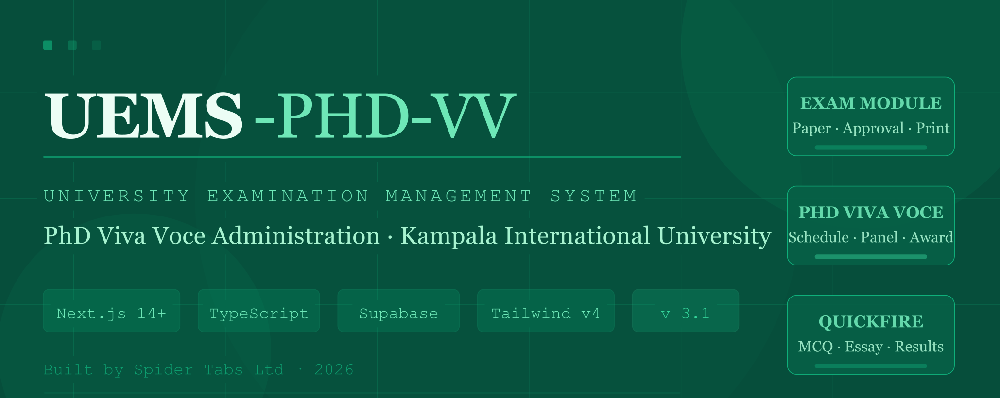

---

## 📋 Table of Contents

- [Overview](#-overview)
- [Problem Statement](#problem-statement)
- [Functional Features](#-functional-features)
- [Non-Functional Features](#-non-functional-features)
- [Extended Features](#-extended-features)
- [Tech Stack](#️-tech-stack)
- [System Workflow](#-system-workflow)
- [Screenshots](#-screenshots)
- [Getting Started](#-getting-started)
- [Project Structure](#-project-structure)
- [Database Schema](#️-database-schema)
- [User Roles](#-user-roles)
- [API Routes](#-api-routes)
- [Development Roadmap](#-development-roadmap)
- [Contributing](#-contributing)
- [Licence](#-licence)

---

## 🌟 Overview

**UEMS-PHD-VV** (University Examination Management System — PhD Viva Voce) is a unified digital platform developed for Kampala International University that addresses the full academic examination lifecycle in a single integrated system. It combines a mature course examination workflow with a complete PhD Viva Voce Administration module, and extends both with a cross-platform student assessment portal.

The system consists of **three integrated platforms**:

1. **UEMS-PHD-VV Web** — A Next.js 14 administration interface for Lecturers, Heads of Departments, Deans, Examination Masters, and Viva Coordinators. Covers examination paper management, approval workflows, viva administration, question bank management, invigilation scheduling, and audit tracking.

2. **Quickfire Exam Portal** — A hardened Flutter kiosk application for Linux Desktop, Android, iOS, and Web that enables lecturers to deploy timed in-class MCQ and essay assessments in real time — without requiring HOD approval — with live participation tracking.

3. **Student Mobile Portal** — A Flutter-based mobile application giving students access to examination timetables, course enrollment, viva notifications, thesis status, and academic updates.

Developed under Agile methodology using **Next.js 14, TypeScript, Tailwind CSS v4, Shadcn UI, Flutter, and Supabase (PostgreSQL)**, the system demonstrated measurable improvements in efficiency, security, and transparency based on evaluation data collected from 93 participants.

### Problem Statement

Traditional examination management at KIU involved:

- ❌ Exam papers prepared digitally but distributed via flash drives or printed copies
- ❌ Delays, poor tracking, and weak accountability across the approval chain
- ❌ Risk of document loss or unauthorised modification
- ❌ PhD viva administration handled separately through emails, printed forms, and informal coordination
- ❌ No centralised examiner evaluation records or outcome tracking
- ❌ Disconnected invigilation scheduling and student enrollment visibility

### Our Solution

UEMS-PHD-VV provides:

- ✅ Digital question bank with Bloom's Taxonomy classification
- ✅ Automated multi-stage approval workflows (Lecturer → HOD → Exam Master)
- ✅ Real-time notifications and status tracking
- ✅ Comprehensive, tamper-evident audit logging
- ✅ Role-based access control (RBAC) enforced at the database layer
- ✅ Hierarchical question support with unlimited sub-question nesting
- ✅ PhD candidate lifecycle management (enrolment → thesis → viva → award)
- ✅ Thesis version tracking with automatic versioning via database triggers
- ✅ Viva scheduling, panel assignment, and examiner confirmation
- ✅ Structured examiner evaluation with auto-calculated scores (generated column)
- ✅ Panel recommendation and outcome recording
- ✅ Quickfire Assessments — timed in-class assessments, no HOD approval required
- ✅ Invigilation scheduling with supervisor assignment and enrollment tracking

---

## ✅ Functional Features

### 📚 Question Bank Management

- Create and categorise questions by course, study unit, and difficulty
- Multiple question types: MCQ, Essay, Practical, Case Study, and more
- Bloom's Taxonomy classification for cognitive-level targeting
- Question reusability tracking — usage count updated automatically on paper add/remove
- HOD approval workflow before questions enter the shared bank

### 📝 Exam Paper Creation

- Visual paper builder with drag-and-drop question ordering
- Hierarchical question support with unlimited nesting (e.g., 1a, 1b, 1b(i), 1b(ii))
- Section management (Section A, B, C…) with custom headings and per-section instructions
- Automatic total mark calculation, updated on every add, edit, or remove
- Choice question groups (e.g., "Answer any 2 of 3") with configurable rules
- Real-time formatted paper preview before submission

### ✅ Exam Paper Approval Workflow

```
Draft → Submit → HOD Review → HOD Approval → Ready for Print → Printing → Printed → Published
```

- Multi-stage process with clearly defined state transitions
- Threaded comments at each stage with resolved/unresolved tracking
- Full version history — JSON snapshots captured at every status change
- In-app notifications triggered at every workflow transition

### 🖨️ Print Management

- Centralised print queue for the Exam Master role
- Track printing status (queued → printing → printed) and copy quantities
- Print history with timestamps and quantity records per paper
- Bulk printing support across multiple papers simultaneously

### 🎓 PhD Viva Voce Administration

#### Candidate Lifecycle Management

- Register PhD candidates linked to their user account, programme, and supervisor
- Full doctoral lifecycle tracking:

  ```
  Enrolled → Thesis Submitted → Viva Scheduled → Viva Completed
    → Corrections Pending → Corrections Submitted → Awarded / Withdrawn
  ```

- Status auto-advances on key database events via triggers — no manual coordinator action required
- Record primary supervisors and co-supervisors per candidate

#### Thesis Submission Tracking

- Upload and store thesis PDF versions in Supabase Storage
- Automatic version incrementing on each re-submission (database trigger)
- Submission notes and file metadata recorded per version

#### Viva Scheduling

- Schedule oral defence sessions with date, time, venue, and duration
- Status transitions: `scheduled → in_progress → completed` (or `postponed / cancelled`)
- Postponement reasons recorded for audit purposes

#### Examiner Panel Management

- Structured three-member panels using designated role slots:
  - **Slot 1** — Chairperson (Professor / Senior Staff)
  - **Slot 2** — Internal Examiner (Lecturer / Staff)
  - **Slot 3** — External Examiner
- Role-based filtering in the Configure Panel modal per slot
- Individual examiner confirmation status tracked with notification timestamps
- Unique constraints prevent duplicate assignments per viva

#### Structured Evaluations

- Each examiner submits an independent evaluation scored across four criteria:

  | Criterion | Max Marks |
  |---|---|
  | Originality | 25 |
  | Methodology | 25 |
  | Presentation | 25 |
  | Literature Review | 25 |
  | **Total (auto-calculated)** | **100** |

- Free-text fields for strengths, weaknesses, recommended corrections, and general comments
- `overall_score` is a **generated column** — always consistent, never manually entered
- Evaluations locked in draft until formally submitted

#### Panel Recommendations

- One binding recommendation per viva, issued by the Viva Coordinator:
  - `pass` / `pass_with_minor_corrections` / `pass_with_major_corrections` / `fail`
- Correction deadline tracking for non-pass outcomes
- Final panel comments recorded centrally alongside the recommendation

### ⚡ Quickfire Assessments

- Lecturers create timed MCQ or essay assessments directly — no HOD approval required
- Configurable time limits, results visibility (hidden or revealed), and open/closed status
- Students access via a unique numeric ID in the Quickfire Flutter app
- Live participation tracking and real-time result collection via Supabase Realtime
- Per-student submission reports viewable from the web app
- PDF export with official KIU branding

### 📅 Exam Timetable & Enrollment

- **HOD Timetable Control** — manage exam dates, times, and venues for all published papers
- **Course Enrollment** — students register per course and automatically gain access to corresponding exam schedules
- **Invigilation Assignments** — HODs assign lecturers to supervise specific exam slots
- **Privacy Enforcement** — students see only enrolled courses; lecturers see only their assigned invigilations
- **Automated Notifications** — alerts dispatched on new schedule entries and assignment changes

### 👥 User & Permission Management

- Role-based permissions across six roles: Lecturer, HOD, Dean, Exam Master, Viva Coordinator, Admin
- Granular course-level permissions — HODs grant or revoke question-creation rights per lecturer per course
- Unified Supabase Auth — one set of credentials across the web app, UEMS Mobile, and Quickfire
- Session management with secure token tracking

### 📊 Reports & Analytics

- Dashboard with live metric cards across both the exam paper and PhD modules
- Paper statistics by status, course, and programme
- Viva schedule overview with upcoming vivás, panel confirmation status, and evaluation progress
- Candidate status distribution charts
- Viva outcome charts (Pass, Pass with Corrections, Fail) per programme
- Examiner evaluation summaries with per-criterion and panel-average scores
- Pending Actions alerts for candidates awaiting corrections
- PDF-formatted Viva Voce Examination Reports with KIU branding

### 📱 Student Mobile Application (Flutter) *(Upcoming)*

- Results & Reports — real-time access to viva outcomes and examiner feedback
- Schedule Management — view upcoming viva dates, venues, and panel members
- Thesis Tracker — monitor submission history and version status
- Quickfire Participation — take quick assessments, view scores, and receive immediate feedback
- Smart Notifications — push alerts for schedule changes, examiner confirmations, and results
- Progress Visualisation — dynamic PhD lifecycle tracking (Enrolled → Thesis → Viva → Awarded)

---

## 🔧 Non-Functional Features

### ⚡ Performance

- React Server Components render heavy dashboard pages server-side and stream HTML to the browser, minimising time-to-first-meaningful-paint for data-dense views
- Supabase connection pooling handles concurrent load during peak exam registration and results periods
- Vercel edge network caches static assets and server-rendered pages globally

### 🛡️ Security

- **Supabase Row-Level Security (RLS)** enforced at the database layer — a misconfigured API route cannot expose another user's data because the database itself refuses the query
- RBAC governs every page, API route, and database query; roles are checked server-side on every request
- Unique constraints at the database level prevent duplicate panel assignments and duplicate paper-question orderings
- Environment secrets (`SUPABASE_SERVICE_ROLE_KEY`, `SESSION_SECRET`) stored in Vercel's encrypted environment variables and never committed to the repository
- GitHub branch protection on `clean-main` requires pull request review before any code reaches production

### 🔁 Reliability & Data Integrity

- **Generated column** — `viva_evaluations.overall_score` is computed by PostgreSQL; it cannot be manually overridden
- **Database triggers** enforce automatic state transitions (candidate status on viva insert/complete, thesis version increment, mark recalculation on question changes) — these invariants hold even if the application layer is bypassed
- **Soft deletes** (`deleted_at` timestamp) on all major tables preserve historical records
- **JSON validation** via `CHECK` constraints on all JSON columns rejects malformed data at the database level
- Full version snapshots of every exam paper stored as JSON at each workflow transition

### 🌍 Cross-Platform Consistency

- Web administration interface fully responsive on desktop and laptop viewports
- Quickfire Exam Portal security and lockdown protocols behave consistently across Linux Desktop, Android, iOS, and Web via a unified `fullscreen.dart` platform bridge
- Supabase Auth and RLS policies apply identically regardless of which client (web, UEMS Mobile, or Quickfire) issues the query

### 🎨 Usability & Branding

- Consistent emerald/green design system (`#10B981` primary) aligned with the official KIU visual identity via Tailwind CSS v4 and Shadcn UI
- Status badges, progress bars, and colour-coded lifecycle labels provide at-a-glance situational awareness
- All dialogs and confirmation prompts use formal academic language appropriate to a university context
- Dark mode support via Tailwind's `dark:` variant classes throughout

### 🔧 Maintainability & Developer Experience

- **TypeScript end-to-end** — database query result types, API response shapes, and React component props derive from shared type definitions in `src/types/index.ts`
- Business logic separated into `services/`, `lib/`, and `types/` layers; UI components in `components/ui/` are Shadcn-generated and independently replaceable
- Supabase CLI enables a full-fidelity local stack (PostgreSQL + Auth + Storage + Realtime) via `supabase start`
- GitHub → Vercel CI/CD: every push to `clean-main` triggers an automatic build and production deploy in under 40 seconds; pull requests receive isolated preview URLs

---

## 🚀 Extended Features

### 📋 Audit Logs

Every meaningful action is recorded in the `audit_logs` table. Each entry captures the acting user, their role, the action performed, the affected resource, a before/after JSON diff, IP address, and timestamp. Logs are append-only and cannot be edited or deleted through the application interface, providing a complete tamper-evident history for internal governance and external accreditation audits.

### 🔔 Notification System

A real-time in-app notification centre driven by the `notifications` table. Notifications trigger automatically on workflow events: paper submissions, HOD approvals/rejections, print queue updates, viva scheduling, examiner panel assignments, evaluation submission, and panel recommendations. Each carries a priority level, read/unread flag, and a direct link to the relevant resource. The bell icon in the top navigation displays an unread badge that updates without page refresh.

### 🗂️ Workflow History & Version Control

Every exam paper carries a complete `workflow_history` — a timestamped record of every status transition, the user who triggered it, and the attached comment or reason. Alongside this, `exam_paper_versions` stores a full JSON snapshot of the paper's questions, marks, and metadata at the moment of each transition, enabling exact reconstruction of any prior state.

### 🖨️ PDF Report Generation

The system generates professionally formatted PDFs for two use cases: Viva Voce Examination Reports (carrying the KIU logo, candidate information, full panel evaluation table with per-criterion scores and panel averages, the binding recommendation, and a confidentiality footer) and Quickfire Assessment Reports (per-student submissions with question text, selected answers, and score breakdowns).

### 🔍 Search & Filtering

A global search bar queries across exam papers, questions, courses, and candidates simultaneously. Individual list pages carry contextual filters by course, study unit, Bloom level, difficulty, question type, candidate status, viva date range, and more.

### 🏛️ Organisational Structure Management

Colleges, departments, and programmes are first-class entities shared across both modules. An Admin can add or edit colleges (SOMAC, SONAS, CEM, SOL, etc.), nest departments within them, and attach academic programmes to departments — a single structural change propagates correctly through both modules.

### 📊 Analytics Dashboard *(Planned)*

Per-student time-on-question metrics, submission patterns, and flagged security events. Aggregate cohort-level data to identify questions with unusually high skip or error rates.

### 🤖 AI-Assisted Question Suggestions *(Planned)*

An AI layer will analyse the existing question bank and suggest new questions based on coverage gaps and Bloom's taxonomy distribution. Suggested questions require HOD approval before joining the live bank.

### 📧 Email Notifications — SMTP Integration *(Planned)*

Optional email delivery for all in-app notifications. Critical alerts (viva scheduling, panel assignment, correction deadlines) will be delivered to institutional email addresses regardless of login status.

### 🔑 Biometric Unlock for Quickfire *(Planned)*

Fingerprint or face recognition as an alternative to the 4-digit supervisor PIN on compatible devices during invigilated exam sessions.

### 🌐 Multi-Institution Support *(Planned)*

Multi-tenant deployments for other universities under their own branding and Supabase configuration, with isolated data namespaces enforced at the database level.

---

## 🛠️ Tech Stack

| Component | Technology |
|---|---|
| **Frontend** | Next.js 14+ (App Router), React, TypeScript |
| **Styling** | Tailwind CSS v4, Shadcn UI |
| **Backend** | Next.js API Routes (TypeScript) |
| **Database** | Supabase (PostgreSQL) — local CLI for dev, cloud for production |
| **ORM** | Raw SQL with Supabase client |
| **Authentication** | Supabase Auth (unified across web + mobile apps) |
| **Mobile** | Flutter 3.19+, Dart |
| **State Management** | React Server Components + Client State |
| **Deployment** | Vercel + GitHub (CI/CD via GitHub integration) |

---

## 🔄 System Workflow

### Lecturer Journey

1. **Create Paper** — Select course, exam type, and academic details
2. **Add Questions** — Choose from question bank or add new questions
3. **Add Sub-Questions** — Create hierarchical structures (e.g., 1a, 1b, 1b(i))
4. **Preview** — Review formatted exam paper
5. **Submit** — Send to HOD for approval
6. **Receive Feedback** — View HOD comments and revise if needed

### HOD Journey

1. **Review Submissions** — View pending papers in approval queue
2. **Quality Check** — Review questions, marks, and structure
3. **Provide Feedback** — Add comments or request revisions
4. **Approve/Reject** — Make approval decision
5. **Forward** — Approved papers move to print queue

### Exam Master Journey

1. **View Print Queue** — See all papers ready for printing
2. **Start Printing** — Mark paper as "printing"
3. **Set Quantity** — Specify number of copies
4. **Complete** — Mark paper as "printed"
5. **Publish** — Make paper available for exam day

### Viva Coordinator Journey

1. **Register Candidate** — Create PhD candidate record linked to programme and supervisor
2. **Track Thesis** — Log thesis submission(s); system auto-increments version numbers
3. **Schedule Viva** — Set date, time, venue, and duration
4. **Configure Panel** — Assign examiners to structured slots with role-based filtering
5. **Monitor Evaluations** — Track which examiners have submitted scored evaluations
6. **Issue Recommendation** — Record the panel's binding outcome and any correction deadline
7. **Update Status** — System triggers automatically advance candidate status on key events

### PhD Candidate Status Flow

```
Enrolled
  └─→ Thesis Submitted       (coordinator logs thesis upload)
        └─→ Viva Scheduled   (trigger fires on viva_schedules INSERT)
              └─→ Viva Completed  (trigger fires when schedule status → 'completed')
                    ├─→ Corrections Pending    (minor or major corrections outcome)
                    │     └─→ Corrections Submitted
                    │           └─→ Awarded
                    └─→ Awarded                (pass outcome — direct)
```

---

## 📸 Screenshots

### 🗺️ UEMS Ecosystem Architecture Blueprint

<p style="text-align: justify;">
A technical blueprint diagram rendered in a dark navy grid style mapping the complete UEMS application ecosystem. At the top centre sits the <strong>UEMS-PHD-VV Web</strong> application (Next.js 14, TypeScript, Tailwind, Shadcn UI), serving as the administration hub for HODs, Lecturers, Viva Coordinators, and Admins. Connected bidirectionally via solid teal arrows are <strong>UEMS Mobile</strong> (Flutter 3.19+, targeting Students and PhD Candidates) on the left, and the <strong>Quickfire Exam Portal</strong> (Flutter 3.x, hardened kiosk build) on the right. All three applications connect downward to the central <strong>Supabase (PostgreSQL 15)</strong> block carrying Database, Auth, Realtime, and Storage capabilities.
</p>

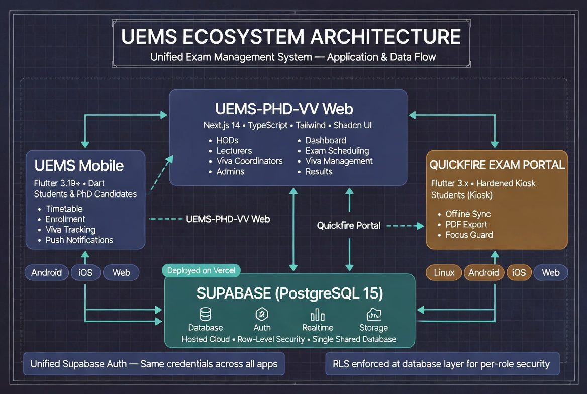

---

### 🚀 Vercel Deployment Dashboard

<p style="text-align: justify;">
The Vercel deployment dashboard for the <strong>spidertabs-uems-php-vv</strong> project. Deployment metadata confirms: Status <strong>Ready</strong>, Duration <strong>39 seconds</strong>, Environment <strong>Production</strong>. Source links directly to the <code>clean-main</code> GitHub branch at commit <code>3397c7b</code>, demonstrating the direct GitHub → Vercel CI/CD pipeline.
</p>

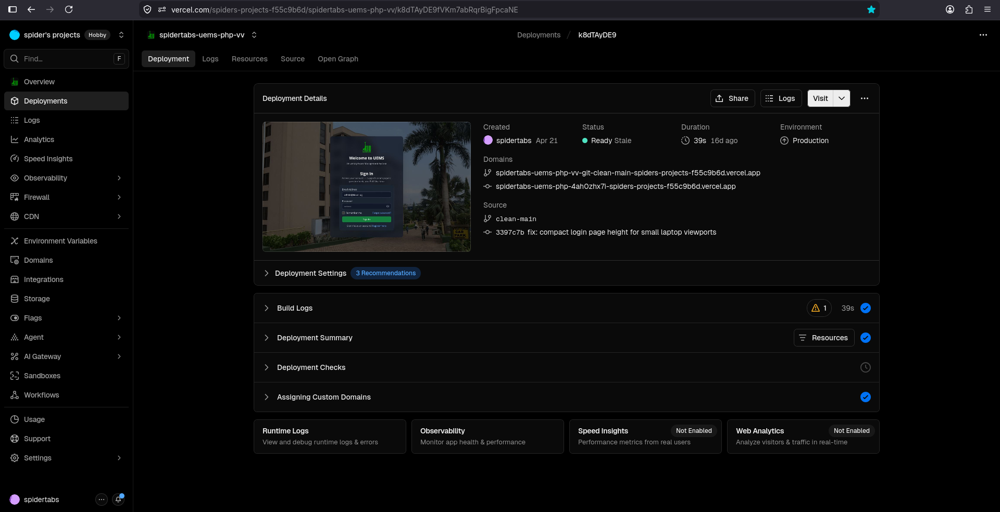

---

### 🗄️ Supabase Database Schema Visualiser

<p style="text-align: justify;">
The Supabase Schema Visualiser for the <code>uems-phd-vv</code> project (PRODUCTION branch), showing the <code>public</code> schema as an interactive entity-relationship canvas. The screenshot focuses on <strong>exam_paper_questions</strong> (supporting the hierarchical question builder with unlimited nesting) and <strong>paper_comments</strong> (with <code>parent_comment_id</code> enabling threaded replies).
</p>

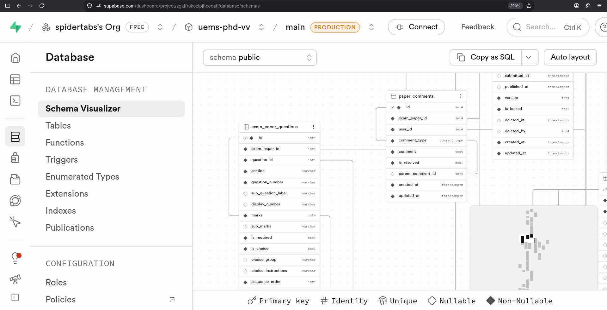

---

### 🏠 HOD Dashboard

*The main dashboard for a Head of Department. Summary cards show Pending Approvals, Department Papers, Department Courses, Question Bank total, and a PhD Candidates counter linking directly to the Viva Voce module. Quick Action shortcuts and a real-time Recent Activity audit trail below.*

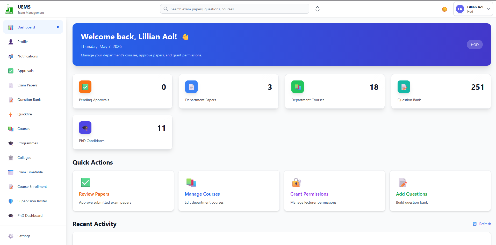

---

### 📚 Question Bank

*Browse, search, and manage all exam questions with filters for Course, Study Unit, Question Type, Difficulty, and Bloom's Taxonomy level. Summary statistics show 251 questions. Each card displays course code, study unit, difficulty, Bloom level, mark value, and question type.*

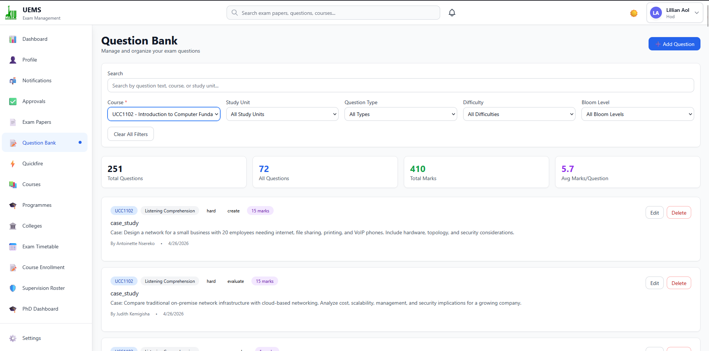

---

### 📅 Exam Timetable

*The Active Schedule controlled by the HOD. Each row shows Exam Paper code, Date & Time, Venue, assigned Supervisors, and Enrollment count visualised as a progress bar against room capacity.*

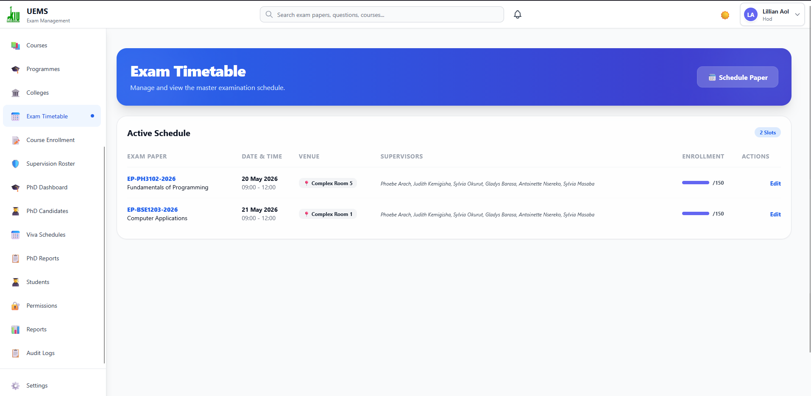

---

### 📋 Course Enrollment

*All courses and their enrollment status for the current semester. Each row shows Course Code, Department, enrolled student count, Schedule Status, and a View Details action.*

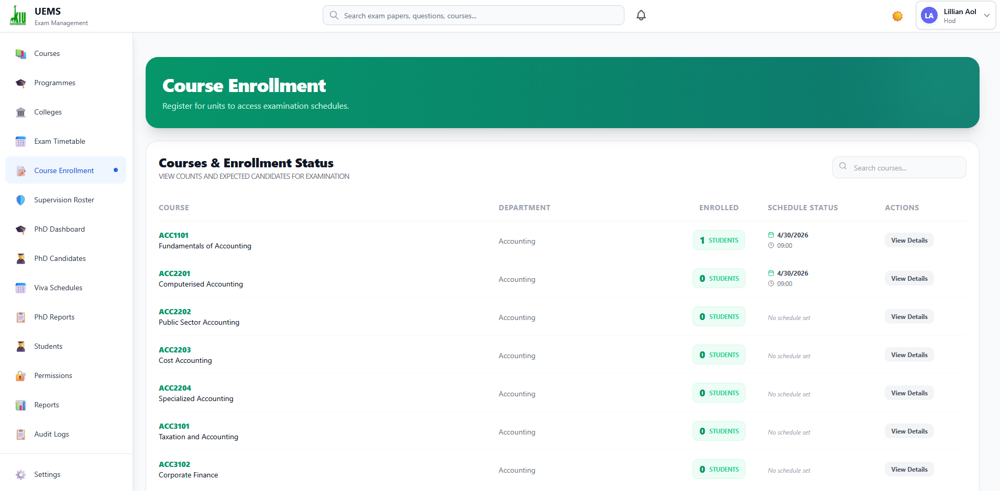

---

### 🛡️ Supervision Roster (Invigilation Overview)

*Card-based view of all active exam slots and their assigned invigilators. Helps the HOD verify every session has adequate coverage and lets supervisors see their assigned rooms.*

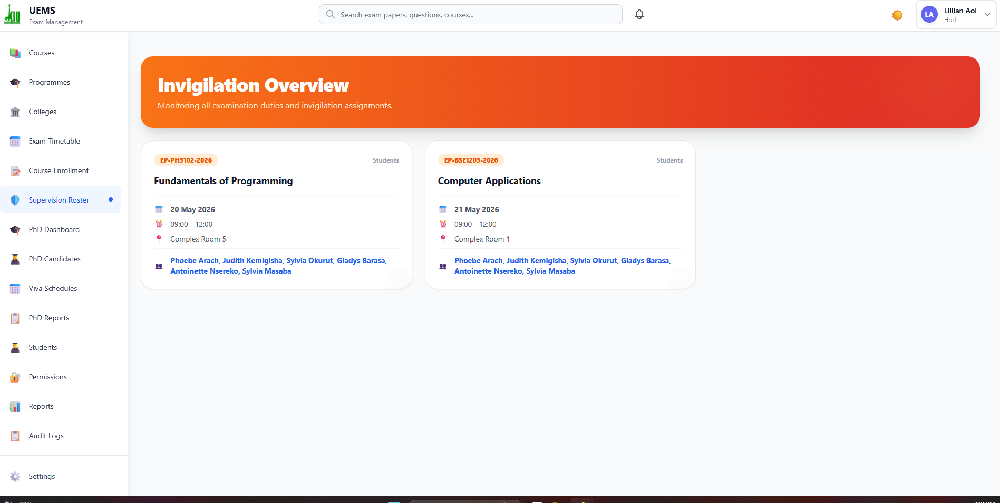

---

### 🎓 PhD Viva Voce Admin Dashboard (HOD View)

*Four summary cards: Total Candidates (9), Upcoming Vivás (2), Pending Outcomes (0), Outstanding Evaluations (0). Upcoming Vivás list with candidate name, registration number, programme, date/time, venue, and panel confirmation status. Candidate Status distribution chart on the right.*

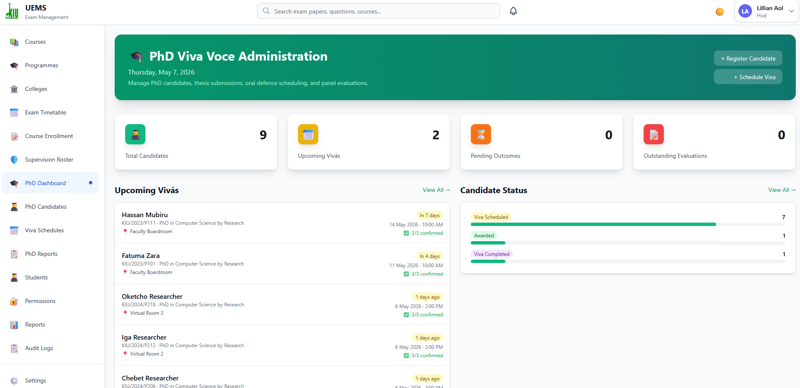

---

### 🎓 PhD Dashboard (Lecturer / Supervisor View)

*Identical layout to the HOD view but scoped to the signed-in lecturer's assigned candidates and vivás.*

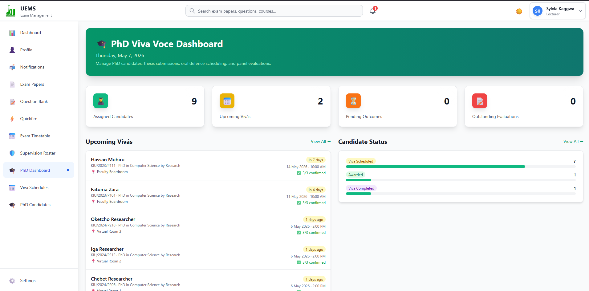

---

### 👥 PhD Candidates (My Candidates — Supervisor View)

*Personalised list scoped to the current staff member (Primary Supervisor, Co-Supervisor, or Examiner). Candidates with pending evaluations show a prominent "Evaluate ★" button and a "PENDING EVALUATION" warning badge.*


---

### 📅 Viva Schedules List

*All oral defence sessions with tab filters: All / Scheduled (6) / In Progress / Completed (2) / Postponed / Cancelled. Each row shows Date & Time, Candidate, Programme, Venue, Evaluations progress (e.g., "0/3"), Status badge, and Outcome.*


---

### 📅 Schedule Viva Form

*Form for creating a new oral defence appointment. Fields include Candidate, Thesis Version, Date, Time, Venue, and Duration. A yellow banner confirms that scheduling will automatically advance the candidate's status via a database trigger.*

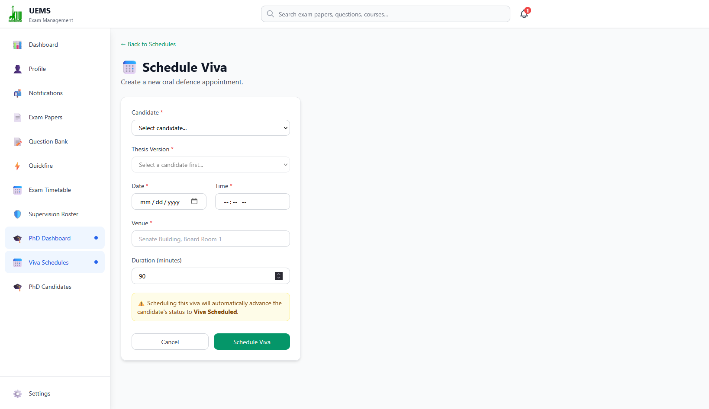

---

### 👨‍⚖️ Viva Detail — Panel & Examiner Assignment

*Viva detail page for candidate Ismail Katende (KIU/2023/P106) showing the Panel & Confirmation tab. Three assigned examiners (Chairperson, Internal Examiner, External Examiner) all shown as "Confirmed". Mark Complete and Postpone action buttons in the page header.*

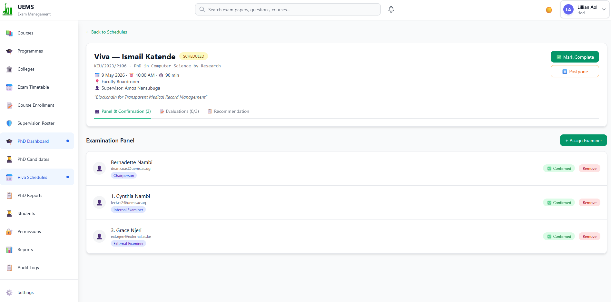

---

### 📊 PhD Reports Overview

*System-wide analytics: Pending Actions alert, Candidate Status Distribution chart (Viva Scheduled: 82%), Viva Outcomes chart, Candidates by Programme table with completion rates, and All Upcoming Vivás table.*

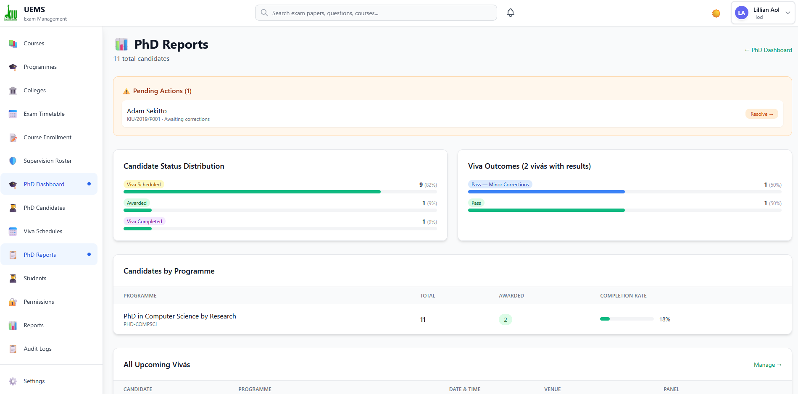

---

### 📄 PhD Viva Voce Examination Report

*Formatted, printable report bearing the KIU logo and "CONFIDENTIAL — Academic Registry" watermark. Includes Candidate Information, Examination Details, and a Panel Evaluations table with per-examiner scores across four criteria and a calculated panel average (81.7/100).*

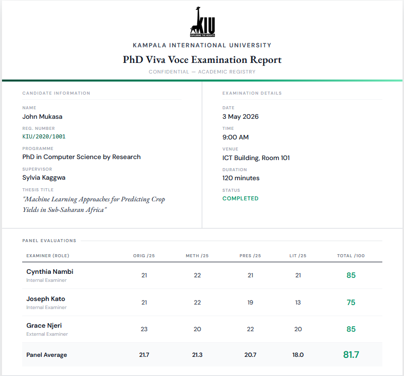

---

### ⚡ Quickfire Assessments — Main Module

*Dark-theme overview page. Summary cards: Total Active (1), Total Completed (1), status badge. Assessment cards show Course code, title, duration, creation date, results visibility, and Reports/Manage buttons.*

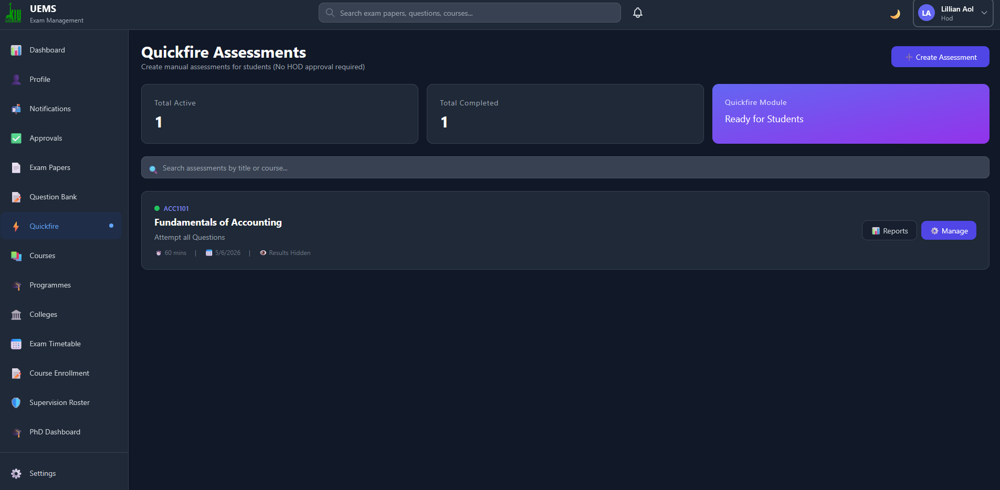

---

### ⚡ Quickfire — Manage Questions

*Question builder for an individual assessment. Left panel: Add Question form (MCQ or Essay, with Options & Correct Answer). Right Settings panel: Status, Time Allotted with extension buttons, Results Visibility. A Launch Info card shows the unique Assessment ID that students enter in the Flutter app.*

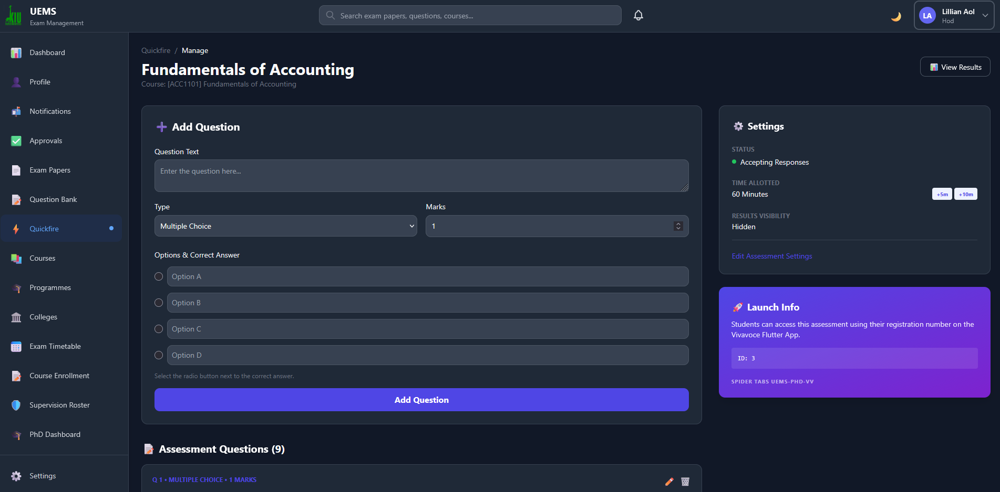

---

## 🚀 Getting Started

### Prerequisites

- Node.js 18+ installed
- npm or yarn package manager
- A [Supabase](https://supabase.com) account (free tier is sufficient)
- [Supabase CLI](https://supabase.com/docs/guides/cli) installed for local development

### Installation

1. **Clone the repository**

   ```bash
   git clone https://github.com/spidertabs/uems.git
   cd uems
   ```

2. **Install dependencies**

   ```bash
   npm install
   ```

3. **Set up environment variables**

   Create a `.env.local` file in the root directory:

   ```env
   # Supabase
   NEXT_PUBLIC_SUPABASE_URL=https://your-project.supabase.co
   NEXT_PUBLIC_SUPABASE_ANON_KEY=your-anon-key
   SUPABASE_SERVICE_ROLE_KEY=your-service-role-key

   # Session Secret
   SESSION_SECRET=your-super-secret-key-here

   # App Configuration
   NEXT_PUBLIC_APP_URL=http://localhost:3000
   NODE_ENV=development
   ```

   For **local development**, use the Supabase CLI:

   ```bash
   supabase start
   ```

   Copy the printed `API URL`, `anon key`, and `service_role key` into `.env.local`.

4. **Apply the database schema**

   ```bash
   supabase db push
   ```

   Or run the seed scripts directly via the Supabase SQL editor:

   ```sql
   \i sql/schema.sql               -- Core schema (UEMS + PhD Viva Voce)
   \i sql/seed.sql                 -- Organisational seed data
   \i sql/seed_phd_vivavoce.sql    -- PhD Viva Voce seed data
   \i sql/study_units.sql          -- Study unit data (optional)
   \i sql/questions.sql            -- Sample questions (optional)
   ```

5. **Run the development server**

   ```bash
   npm run dev
   ```

6. **Open your browser** at [http://localhost:3000](http://localhost:3000)

### Default Login Credentials

All accounts share the default password: **`uems@2026`**

| Role | Email | Notes |
|---|---|---|
| **Admin** | `admin@uems.ac.ug` | Full system access |
| **Exam Master** | `exammaster@uems.ac.ug` | Print queue management |
| **Dean (SOMAC)** | `dean.somac@uems.ac.ug` | College-level oversight |
| **HOD (CS)** | `hod.cs@uems.ac.ug` | Dept 14 — also PhD supervisor |
| **HOD (Physics)** | `hod.phy@uems.ac.ug` | Dept 19 — also PhD supervisor |
| **Viva Coordinator** | `viva.coord1@uems.ac.ug` | PhD viva scheduling & outcomes |
| **Lecturer (CS)** | `lect.cs1@uems.ac.ug` | Also a viva panel examiner |
| **PhD Candidate** | `phd.cs001@uems.ac.ug` | Candidate in viva_completed state |

---

## 📁 Project Structure

```
uems/
├── public/
│   ├── static/images/              # KIU logos and branding
│   └── screenshots/                # Application screenshots
├── sql/
│   ├── schema.sql                  # Full schema (UEMS + PhD Viva Voce)
│   ├── seed.sql                    # Core organisational data
│   ├── seed_phd_vivavoce.sql       # PhD Viva Voce seed data
│   ├── study_units.sql             # Study unit data
│   └── questions.sql               # Sample questions
├── src/
│   ├── app/
│   │   ├── api/
│   │   │   ├── auth/               # Authentication endpoints
│   │   │   ├── exam-papers/        # Paper management
│   │   │   ├── question-bank/      # Question CRUD
│   │   │   ├── approvals/          # Approval workflows
│   │   │   ├── print-queue/        # Print management
│   │   │   └── phd/                # PhD Viva Voce endpoints
│   │   │       ├── candidates/
│   │   │       ├── thesis/
│   │   │       ├── schedules/
│   │   │       ├── examiners/
│   │   │       ├── evaluations/
│   │   │       └── recommendations/
│   │   ├── (dashboard)/
│   │   │   ├── page.tsx            # Dashboard home
│   │   │   ├── exam-papers/
│   │   │   ├── question-bank/
│   │   │   ├── approvals/
│   │   │   └── phd/                # PhD Viva Voce UI
│   │   │       ├── candidates/
│   │   │       ├── schedules/
│   │   │       ├── evaluations/
│   │   │       └── recommendations/
│   │   ├── auth/
│   │   ├── globals.css
│   │   └── layout.tsx
│   ├── components/
│   │   └── ui/                     # Shadcn UI components
│   ├── lib/
│   │   ├── db.ts                   # Database connection
│   │   ├── auth.ts                 # Auth utilities
│   │   ├── rbac.ts                 # Role-based access control
│   │   ├── auditLogger.ts          # Audit logging
│   │   └── utils.ts                # Helper functions
│   └── types/
│       └── index.ts                # TypeScript type definitions
├── .env.local
├── package.json
├── tsconfig.json
└── tailwind.config.js
```

---

## 🗄️ Database Schema

The schema is organised into 15 sections in a single `schema.sql` file.

### Core Tables (UEMS — Sections 1–10)

| Table | Purpose |
|---|---|
| `colleges` | Academic colleges / schools (SOMAC, SONAS, CEM, SOL, etc.) |
| `departments` | Departments nested under colleges |
| `programmes` | Academic programmes (BIT, DIT, LLB, MPH, PhD CS, etc.) |
| `staff` | All user accounts — role determined by `role` ENUM |
| `courses` | Individual courses with HOD ownership |
| `study_units` | Modules / topics inside a course |
| `questions` | Question bank with Bloom's Taxonomy and JSON options |
| `exam_papers` | Exam paper metadata and full approval-state machine |
| `exam_paper_versions` | Full JSON snapshots for version history |
| `exam_paper_questions` | Questions in papers — unlimited sub-question nesting |
| `lecturer_permissions` | HOD-granted course-level permissions |
| `workflow_history` | Complete audit trail of every paper status transition |
| `paper_comments` | Threaded feedback on papers |
| `notifications` | User notifications for both modules |
| `audit_logs` | System-wide activity log |

### PhD Viva Voce Tables (Section 11)

| Table | Purpose |
|---|---|
| `phd_candidates` | PhD students — user account, programme, supervisor, lifecycle status |
| `thesis_submissions` | Uploaded thesis versions (auto-versioned by trigger) |
| `viva_schedules` | Oral defence appointments with venue and status |
| `viva_examiners` | Panel members per viva (chairperson / internal / external) |
| `viva_evaluations` | Per-examiner scored evaluations; `overall_score` is a **generated column** |
| `viva_recommendations` | Binding panel outcome — one per viva |

### Pre-built Views (Section 12)

| View | Used By |
|---|---|
| `hod_pending_approvals` | HOD approval queue |
| `papers_ready_for_print` | Exam Master dashboard |
| `vw_paper_questions_hierarchy` | Paper preview and printing |
| `vw_viva_schedule_overview` | Viva Coordinator dashboard |
| `lecturer_permissions_summary` | Admin / HOD permissions panel |

### Triggers (Section 13)

| Trigger | Purpose |
|---|---|
| `trg_prevent_subquestions_when_disabled` | Blocks sub-question insertion when parent disallows it |
| `trg_marks_after_insert/update/delete` | Auto-recalculates `exam_papers.total_marks` |
| `trg_increment_question_usage` | Increments `questions.usage_count` on paper add |
| `trg_decrement_question_usage` | Decrements on paper remove |
| `trg_candidate_status_on_viva_schedule` | Sets candidate status → `viva_scheduled` on viva insert |
| `trg_candidate_status_on_viva_complete` | Sets candidate status → `viva_completed` when viva completes |
| `trg_thesis_version_increment` | Auto-increments thesis `version` on each re-submission |

### Key Design Decisions

- **Unified schema** — Both UEMS and Viva Voce share `staff`, `programmes`, `departments`, and `colleges` with no duplication
- **Generated column** — `viva_evaluations.overall_score` is always computed from the four criteria scores; never manually writable
- **Soft deletes** — `deleted_at` present on all major tables
- **JSON validation** — `CHECK` constraints on all JSON columns
- **Unique constraints** — Prevent duplicate panel assignments and duplicate paper-question ordering

---

## 👥 User Roles

| Role | Key Responsibilities |
|---|---|
| **Lecturer** | Create exam papers, add questions (with permission), submit for approval, track status |
| **HOD** | Manage courses and study units, approve questions and papers, grant permissions, serve as PhD supervisor or examiner |
| **Dean** | College-level oversight, cross-department paper review, optional approval layer |
| **Exam Master** | Manage the print queue, track printing status and quantities, publish papers |
| **Viva Coordinator** | Register candidates, schedule vivás, assign panels, monitor evaluations, issue recommendations |
| **Admin** | Full system access, user and role management, audit log access, soft-delete recovery |

---

## 🔌 API Routes

### Authentication

```
POST   /api/auth/login
POST   /api/auth/logout
POST   /api/auth/register
GET    /api/auth/me
POST   /api/auth/change-password
```

### Exam Papers

```
GET    /api/exam-papers
POST   /api/exam-papers/create
GET    /api/exam-papers/[paperId]
PUT    /api/exam-papers/[paperId]
DELETE /api/exam-papers/[paperId]
POST   /api/exam-papers/[paperId]/submit
POST   /api/exam-papers/[paperId]/approve
GET    /api/exam-papers/[paperId]/questions
POST   /api/exam-papers/[paperId]/questions
DELETE /api/exam-papers/[paperId]/questions/[questionId]
```

### Question Bank

```
GET    /api/question-bank
POST   /api/question-bank/create
GET    /api/question-bank/[id]
PUT    /api/question-bank/[id]
DELETE /api/question-bank/[id]
```

### Approvals

```
GET    /api/approvals/pending
POST   /api/approvals/[paperId]/approve
POST   /api/approvals/[paperId]/reject
```

### Print Queue

```
GET    /api/print-queue
GET    /api/print-queue/[paperId]
POST   /api/print-queue/[paperId]/start
POST   /api/print-queue/[paperId]/complete
```

### PhD Candidates

```
GET    /api/phd/candidates
POST   /api/phd/candidates/create
GET    /api/phd/candidates/[candidateId]
PUT    /api/phd/candidates/[candidateId]
```

### Thesis Submissions

```
GET    /api/phd/candidates/[candidateId]/thesis
POST   /api/phd/candidates/[candidateId]/thesis/upload
GET    /api/phd/thesis/[thesisId]
```

### Viva Schedules

```
GET    /api/phd/schedules
POST   /api/phd/schedules/create
GET    /api/phd/schedules/[vivaId]
PUT    /api/phd/schedules/[vivaId]
POST   /api/phd/schedules/[vivaId]/complete
POST   /api/phd/schedules/[vivaId]/postpone
```

### Viva Examiners

```
GET    /api/phd/schedules/[vivaId]/examiners
POST   /api/phd/schedules/[vivaId]/examiners/assign
PUT    /api/phd/schedules/[vivaId]/examiners/[examinerId]/confirm
DELETE /api/phd/schedules/[vivaId]/examiners/[examinerId]
```

### Viva Evaluations

```
GET    /api/phd/schedules/[vivaId]/evaluations
POST   /api/phd/evaluations/create
PUT    /api/phd/evaluations/[evaluationId]
POST   /api/phd/evaluations/[evaluationId]/submit
```

### Viva Recommendations

```
GET    /api/phd/schedules/[vivaId]/recommendation
POST   /api/phd/recommendations/create
```

### Notifications

```
GET    /api/notifications
POST   /api/notifications/[id]/read
POST   /api/notifications/mark-all-read
```

---

## 🎯 Development Roadmap

### ✅ Phase 1 — UEMS Core (Completed)

- [x] Database schema design
- [x] Authentication system
- [x] Question bank CRUD with Bloom's Taxonomy
- [x] Exam paper creation with hierarchical questions
- [x] Multi-stage approval workflow
- [x] Print queue management

### ✅ Phase 2 — PhD Viva Voce Integration (Completed)

- [x] Unified database schema (UEMS + Viva Voce)
- [x] PhD candidate lifecycle management
- [x] Thesis submission with auto-versioning
- [x] Viva scheduling and structured panel management
- [x] Examiner evaluation with generated overall score
- [x] Panel recommendation and outcome recording
- [x] Status-change triggers (candidate auto-progression)
- [x] Viva Coordinator role and permissions
- [x] Notification types for viva events
- [x] PDF Viva Examination Report generation
- [x] Quickfire Assessments module

### 🔄 Phase 3 — In Progress

- [ ] Bulk operations on exam papers
- [ ] Advanced reporting and analytics dashboard
- [ ] Full-text search and smart filters
- [ ] Email notifications (SMTP integration)

### 📅 Phase 4 — Planned

- [ ] Student Mobile Portal (Flutter)
- [ ] AI-powered question suggestions
- [ ] Biometric unlock for Quickfire
- [ ] External examiner self-service portal
- [ ] Plagiarism detection for thesis submissions
- [ ] Multi-institution support

---

## 🤝 Contributing

1. Fork the repository
2. Create a feature branch: `git checkout -b feature/AmazingFeature`
3. Commit your changes: `git commit -m 'Add some AmazingFeature'`
4. Push to the branch: `git push origin feature/AmazingFeature`
5. Open a Pull Request

### Coding Standards

- Use TypeScript for all new code
- Follow the existing code structure and naming conventions
- Add JSDoc comments for all exported functions
- Write meaningful commit messages
- Test changes before submitting

---

## 📄 Licence

This project is licensed under the MIT Licence — see the [LICENCE](LICENCE) file for details.

**Copyright © 2026 Spider Tabs Ltd**

---

## 👨‍💻 Authors

- **Gava Hans** — Lead Developer
- **Ocen Isaac** — Developer
- **Kamuntu David** — Developer
- **Sempuwo Mathew David** — Developer

---

## 🙏 Acknowledgments

- **Kampala International University** for the opportunity to develop this system
- **Shadcn UI** for the component library
- **Next.js Team** for the framework
- All participants in the 93-person evaluation study

---

## 📧 Contact

- **Project Team**: Gava Hans, Ocen Isaac, Sempuwo Mathew David
- **Email**: [spider.tabs@gmail.com](mailto:spider.tabs@gmail.com)

---

<div align="center">
  <p>Built with ❤️ by <strong>Spider Tabs Ltd</strong> at Kampala International University</p>
  <p>
    
  </p>
  <p><em>Gava Hans • Ocen Isaac • Kamuntu David • Sempuwo Mathew David</em></p>
  <p><strong>UEMS-PHD-VV v3.1</strong></p>
</div>